<div class="doc-header">
  <h1>Android アプリで RTL 言語対応をする（画像編）</h1>
  <div class="doc-author">akatsuki174</div>
</div>

# Android アプリで RTL 言語対応をする（画像編）

Android アプリでアラビア語などの RTL（Right to Left / 右から左）記述法を使用する言語（以降、RTL 言語とする）に対応する場合、翻訳リソースの追加はもちろん、方向性のある一部のアイコンは RTL 言語用として変更するのが適切です。

根拠：インターフェイスアイコン - Human Interface Guidelines[^human_interface_guidelines_interface-icons]

とはいえ簡単にいかない場合もあるので、対応方法について書きたいと思います。

※ 基本 Jetpack Compose 前提で書きます。

[^human_interface_guidelines_interface-icons]: インターフェイスアイコン - Human Interface Guidelines https://developer.apple.com/jp/design/human-interface-guidelines/right-to-left#Interface-icons

## 前提

RTL 言語をサポートするには `AndroidManifest.xml` に以下の記述を追加する必要があります（といっても、新規にプロジェクトを作成したらデフォルトで記述されてそうです）。

```xml
<application ...
    android:supportsRtl="true">
</application>
```

実装の確認方法としては、端末の第一言語をアラビア語（地域：サウジアラビア）にして意図通りになっているかを見ています。

※ 開発者モードに「RTL レイアウト方向を使用」というものがあります。これは端末の言語設定に関係なく、強制的に RTL レイアウトを適用できるというものです。つまり、端末が日本語でも RTL レイアウトになります。「アラビア語にしたら設定アプリもアラビア語になって、日本語に戻すのが大変だった」ということはまああるので、デバッグ効率化のためにこちらを活用するのも手です。

cf. デバイスの開発者向けオプションを設定する[^dev_options_drawing]

試しに設定してみると、日本語環境でアイコンが左右反転した状態になってました。

| 設定 | 設定前 | 設定後 |
| :-- | :-- | :-- |
| 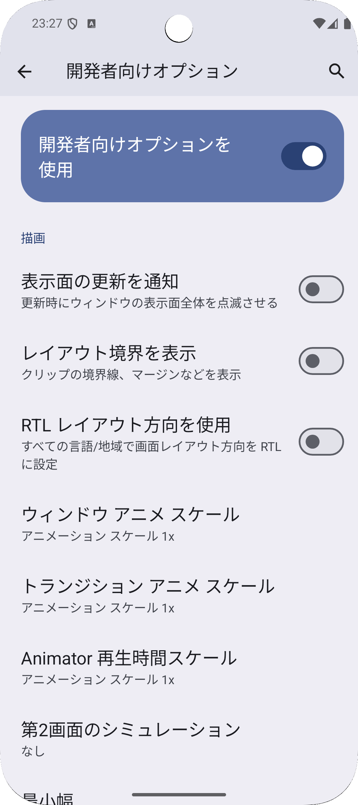{width=100} | 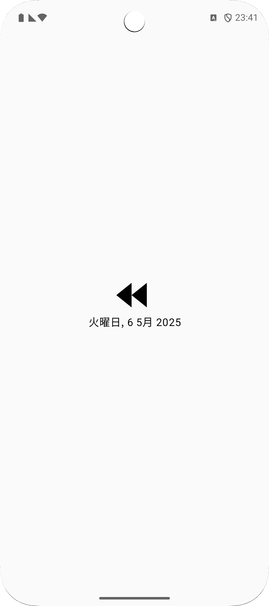{width=100} | 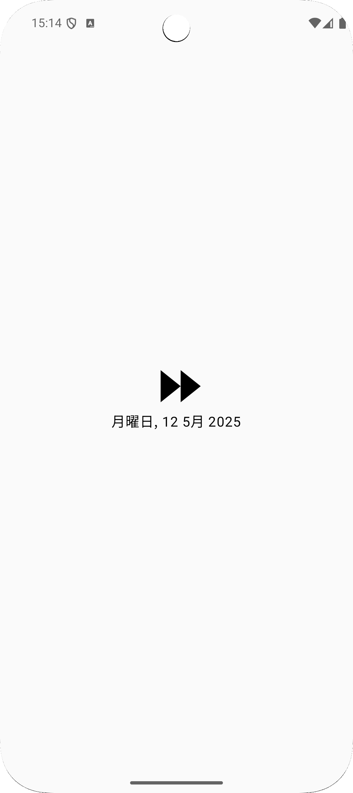{width=100} |

[^dev_options_drawing]: デバイスの開発者向けオプションを設定する https://developer.android.com/studio/debug/dev-options?hl=ja#drawing

## 方法の選定

アイコンを左右反転させる方法はいくつかあります。

結論から言うと、

- ベクター画像を使っている
    - $\rightarrow$ autoMirrored の設定を追加する
- ベクター画像ではない or 単純に左右を反転させればいいわけではない or 上記の方法では対応できない
    - $\rightarrow$ RTL 言語用リソースを別途用意する

がおすすめかなと思います。

## ベクター画像に設定を記述する

ベクター画像の xml に1行追加するだけの方法です。

### autoMirrored の設定を追加する

ベクター画像の xml の `vector` 部分に `android:autoMirrored="true"` を追記するだけです。

```xml
<vector xmlns:android="http://schemas.android.com/apk/res/android"
    android:width="24dp"
    android:height="24dp"
    android:autoMirrored="true"
    android:viewportWidth="24"
    android:viewportHeight="24">
```

使う側は今まで通りです。

```kotlin
@Composable
fun VolumeIcon() {
    Image(
        painter = painterResource(id = R.drawable.ic_volume),
        contentDescription = null,
    )
}
```

### 動かしてみる

自作のボリュームアイコンがちゃんと左右反転しました。

| アラビア語 | 日本語 |
| :-- | :-- |
| 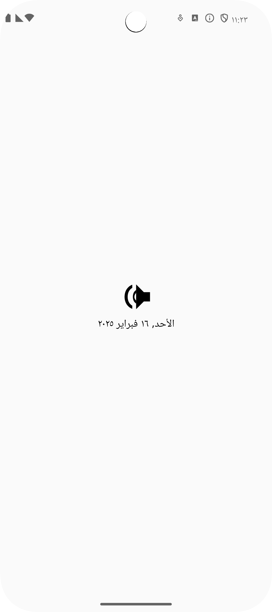{width=170} | 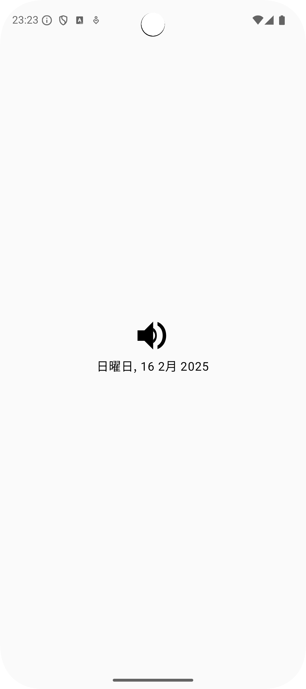{width=170} |

## RTL 言語用リソースを別途用意する

左右反転したリソースを準備する方法です。 `strings.xml` を言語ごとに用意するのと考え方的には同じなのかなと思います。

公式ドキュメントの代替リソースの指定[^providing-resources]の「レイアウト方向」の項目に沿って対応してみます。

[^providing-resources]: 代替リソースの指定 https://developer.android.com/guide/topics/resources/providing-resources?hl=ja

### 専用ディレクトリを用意して入れる

`drawable-ldrtl` ディレクトリを用意し、RTL 言語用の画像リソースをここに追加します。

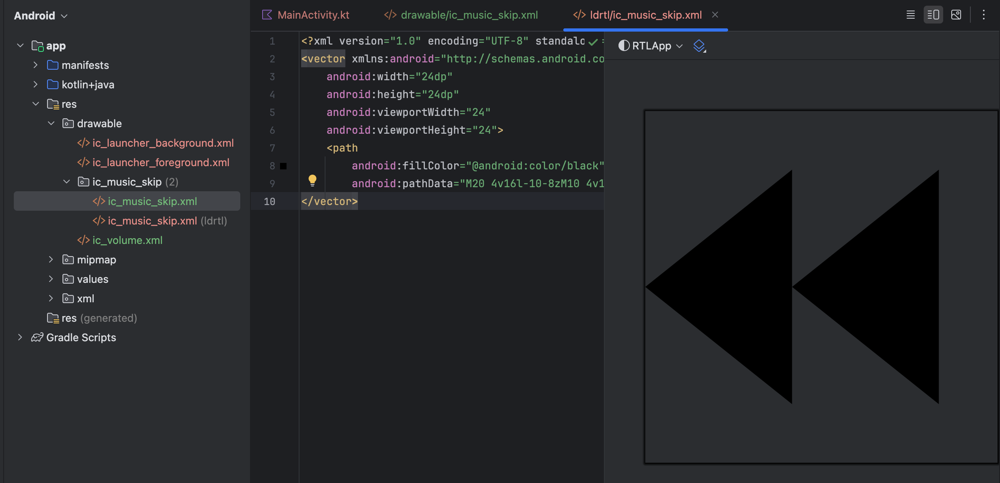
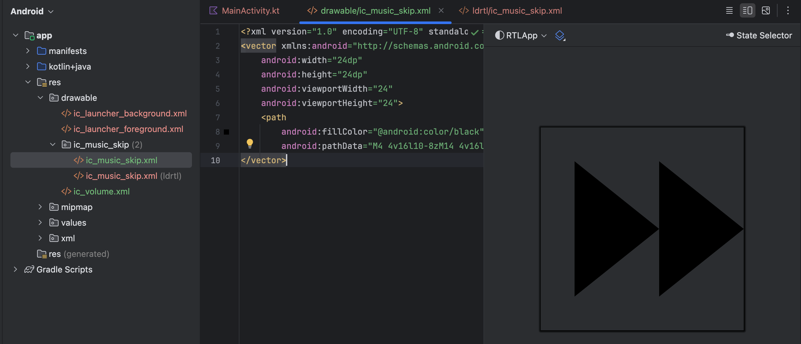

実装コードはいつも通り。

```kotlin
@Composable
fun MusicSkipIcon() {
    Image(
        painter = painterResource(id = R.drawable.ic_music_skip),
        contentDescription = null,
        modifier = Modifier.size(56.dp)
    )
}
```

### 動かしてみる

ちゃんと RTL 言語と LTR 言語で画像が変わっています。

| アラビア語 | 日本語 |
| :-- | :-- |
| 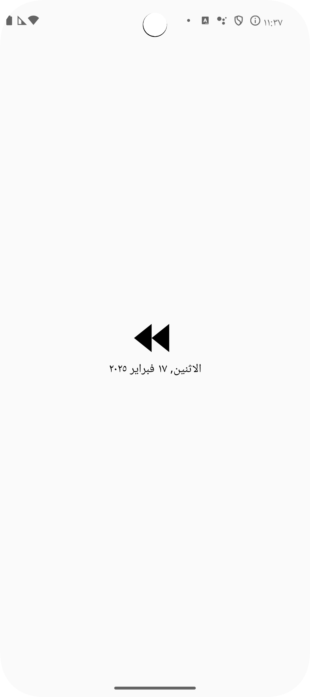{width=170} | 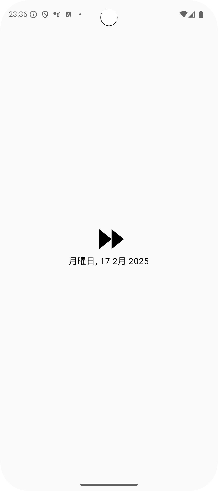{width=170} |

## どちらの方法を使うか

ベクター画像を使っている場合は基本的に `android:autoMirrored="true"` を使うのがいいと思います。

- メリット
    - デザイナー工数がいらない
    - 画像リソースを増やすことなく対応できる
- デメリット
    - ベクター画像以外にこの方法が使えない
    - 単純に左右反転ではない画像に対応できない
    - （Android View において）Glide を使っていると対応が難しい

ということで上記デメリットに当てはまる場合は RTL 言語用リソースを用意するのがいいと思います。

## おまけ： その他の方法

## ImageView で scaleX=-1 を設定する

PNG などの場合はこのようにコードで反転させる方法も使えます。完全 Android View の場合も同じようにできるはず。

```kotlin
@Composable
fun ImageViewWithAndroidView() {
    val context = LocalContext.current
    AndroidView(
        factory = { ctx ->
            LayoutInflater.from(ctx).inflate(R.layout.image_view_layout, null)
        },
        update = { view ->
            val imageView = view.findViewById<ImageView>(R.id.imageView)
            if (context.resources.configuration.layoutDirection == View.LAYOUT_DIRECTION_RTL) {
                // direction が RTL 言語だったら scaleX を変更
                imageView.scaleX = -1f
            }
        }
    )
}
```

結果は以下の通り。ほうら、私のプロフィール画像が左右反転してるだろ？（わかりづらい）

| アラビア語 | 日本語 |
| :-- | :-- |
| 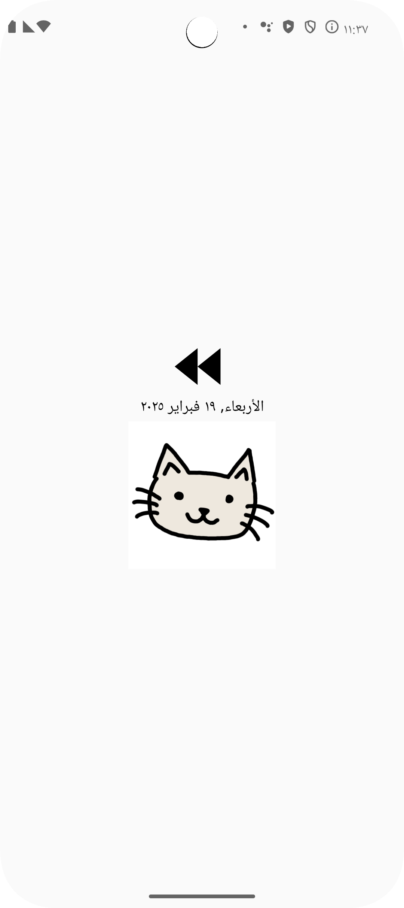{width=170} | 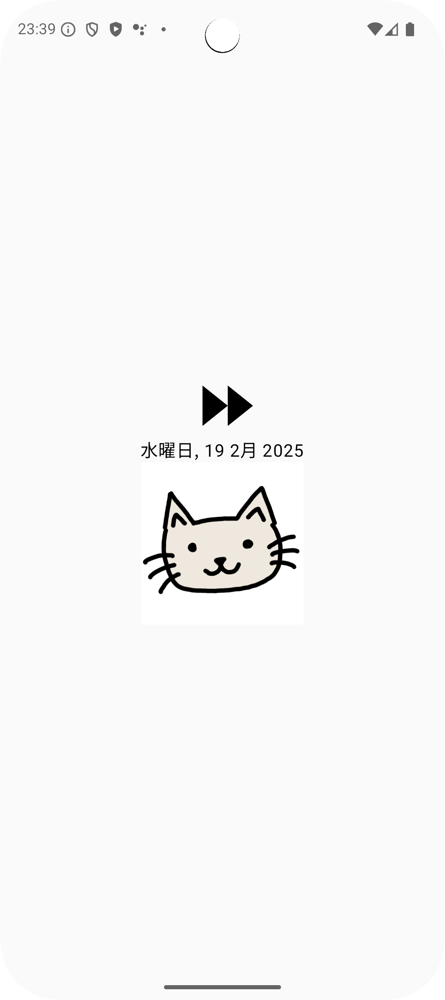{width=170} |

## 最後に

今回は Android アプリを RTL 言語対応する時に発生するアイコン周りの処理について書いてみました。アプリ全体を RTL 言語対応するにはレイアウトなども対応しないといけないですが、それはまた別の機会に...。

公式ドキュメントに「各種の言語および文化をサポートする」[^support_languages]という項目があるので、ぜひそちらも参考にしてみてください。

[^support_languages]: 各種の言語および文化をサポートする https://developer.android.com/training/basics/supporting-devices/languages?hl=ja