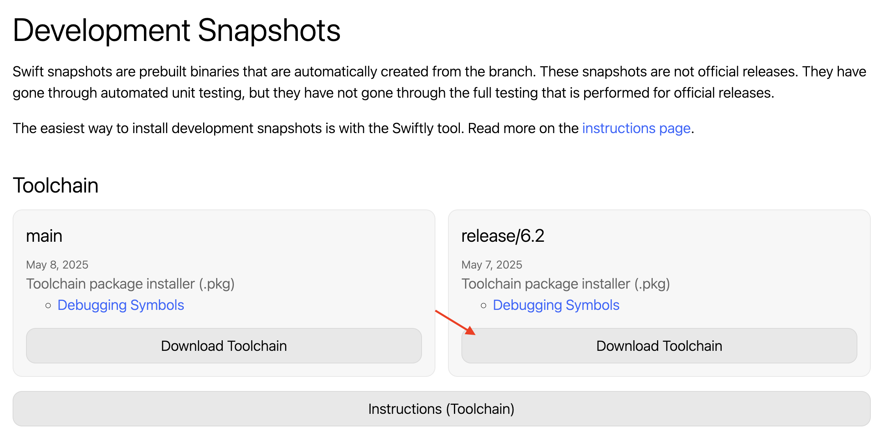

<div class="doc-header">
  <h1>Swift と Java の相互運用</h1>
  <div class="doc-author">川島慶之</div>
</div>

Swift と Java の相互運用
==

## はじめに

2024年9月 ServerSide-Swift<span class="footnote">Swift & Interoperability - Tony Parker & Ben Cohen https://www.youtube.com/watch?v=wn6C_XEv1Mo</span> が開催され、Apple から Swift と Java を相互運用するためのライブラリ<span class="footnote">Swift Java Interoperability Tools and Libraries https://github.com/swiftlang/swift-java</span>が公開されました。Swift Forum<span class="footnote">Java interoperability effort https://forums.swift.org/t/java-interoperability-effort/74969</span> もオープンになり、広く意見を募っています。また2025年3月 try! Swift Tokyo<span class="footnote">try! Swift Tokyo 2025 - Foreign Function and Memory APIs and Swift/Java interoperability https://www.youtube.com/watch?v=vgtzhTOhEbs</span> では最新情報について発表もありました。この記事では、Swift と Java の相互運用について書きます。

お断りとして、執筆時点では、**Early Development**<span class="footnote">まだ開発初期段階であり、今後変更される可能性がある</span> です。おそらく出版された段階でもまだそうだと予想します。

また Swift から Java の呼び出しは確認できましたが、Java から Swift の呼び出しは執筆時点で確認できませんでした。この辺り開発段階によるものなのか、自環境によるものなのか切り分けができていないため、記事を読んでのフィードバックを歓迎します。Issue<span class="footnote">JavaKitSampleApp fails with redefinition of module 'JavaRuntime' https://github.com/swiftlang/swift-java/issues/229</span> を立てているので、こちらに直接コメントをもらえると助かります。

### 動機

まず、Swift と Java の相互運用をしたい動機についてです。

Apple では、一日数十億件ものリクエストを処理する Java コードが多数存在しています。Java のメモリ使用量に関して過去二十年間でかなり進歩したものの、それでも課題となるケースはあります。Swift に移行することでこれを軽減できることはわかっています。そこで、Java の相互運用性を Swift にもたらす取り組みが開始されました。C/C++ への移行でも軽減できるものの、メモリセーフな Swift を利用したいのが強い動機となっています。

### 相互運用性の重要性

さて、相互運用性はそこまで大事なものでしょうか？

今からおよそ十一年前の2014年9月 Swift を利用してすぐにアプリをリリースできる状態になっていました。Objective-C とシームレスに相互運用できたので、Swift は高い生産性を出すことができたのです。既存のコードベースで新しい言語への移行を成功させる上で相互運用性は不可欠です。

長く保守を続けてメンテナンスやチューニングが難しい状態のコードベースがここにあったとします。そこに新しく参画した人はこう言います。

**「全部書き直した方が速い」**

しかし、実際に全部書き直そうとして失敗したプロジェクトは数多く存在します <span class="footnote">Netscape, Microsoft Access, Word for Windows のプロジェクトなど、大規模なリライトに失敗した事例としてしばしば言及されます https://www.joelonsoftware.com/2000/04/06/things-you-should-never-do-part-i/</span><span class="footnote">Windows Vista の開発においても、同様のリライトの試みとその失敗が見られます https://benbob.medium.com/what-really-happened-with-vista-an-insiders-retrospective-f713ee77c239</span>。もし、Swift と Objective-C に相互運用性がなく、当時 Objective-C のコードを全て Swift に書き換えていたらすぐにアプリをリリースすることはできなかったでしょう。もしかしたら、相互運用性があるにも関わらず、全部書き直すと判断をしてしまい、リリースできなかったり、できたとしても想定よりも大きくスケジュールが遅延したのではないでしょうか。

また一気に置き換えると決断した場合、そのプロジェクトの期間は長くなり、古いコードベースと新しいコードベースのチームに分かれることがしばしばです。そこに分断が発生し、ましてや古い方をメンテナンスしたいメンバーの方が稀で偏りが生まれる可能性があります。

一方、段階的であれば、ワンチームで既存のコードと新しいコードの両方を見ていくことになります。さらに問題のない部分はそのままでよく、パフォーマンスに問題のある部分だけを新しいコードに書き直すことができます。

いずれにおいても、**段階的なアプローチ**を取る方が賢明です。

現在およそ一億の Swift アプリがあり、これは Objective-C から Swift への移行が順調に進んでいることを示しています。この成功を踏まえて、Swift に Java との相互運用性を持たせようという判断がされています。

## 入門

ここから Swift と Java の相互運用を実際に試していきます。

swift-java のリポジトリにサンプルコードが用意されているので clone します。

```
git clone git@github.com:swiftlang/swift-java.git
```

### 必要なもの

Swift から Java を呼び出す場合と Java から Swift を呼び出す場合とでは要求されるものが異なります。ここでは、一旦 Java から Swift に必要なものを列挙します。

- Swift 6.x development snapshot
- JDK 22

<hr class="page-break" />

#### Swift 6.x development snapshot

Development Snapshot<span class="footnote">https://www.swift.org/install/macos/</span> から Toolchain<span class="footnote">Swift プログラムの開発・ビルド・デバッグに必要なツール群をまとめたもの https://www.swift.org/install/macos/package_installer/</span> release/6.2 をダウンロードしてインストールします。



インストールに成功すると、次のコマンドで `6.2-dev` の Swift version が確認できます。

```
% xcrun --toolchain swift swift --version
Apple Swift version 6.2-dev (LLVM 815013bbc318474, Swift 1459ecafa998782)
Target: arm64-apple-macosx15.0
Build config: +assertions
```

#### JDK 22

JDK のバージョン指定があるため、Java のバージョン管理ツールとして SDKMAN<span class="footnote">SDKMAN https://sdkman.io/</span> の利用をおすすめします。SDKMAN のインストールや詳しい使い方は公式のドキュメントを参照ください。

Java 22 は LTS<span class="footnote">Oracle Java SE Supportロードマップ LTS は 8, 11, 17, 21, 25 https://www.oracle.com/jp/java/technologies/java-se-support-roadmap.html</span> ではないため、SDKMAN では、唯一 Oracle だけが提供しています <span class="footnote">非常に紛らわしいですが、一見 Gluon と Liberica NIK も提供しているように見えましたが、それぞれ提供しているバージョン Gluon 22.1.0.1.r17 と Liberica NIK 22.3.5.r17 は、先頭の `22` ではなく、 `r17` の部分が JDK のバージョンなので JDK 22 ではなく JDK 17 です。知らないと罠です。</span>。ただし、LTS ではないため、時期によっては Oracle からも提供を終了している可能性もあるかもしれません。その場合は、SDKMAN を利用せずに直接アーカイブをダウンロードしてインストールする必要があります。

##### SDKMAN

```
sdk install java 22.0.2-oracle
```

なお README には JDK 22+ と書いてありますが、このあと実行する Samples は `JavaLanguageVersion.of(22)` と指定しているので 23 や 24 ではビルドできません。単純に `JavaLanguageVersion` の指定を 23 や 24 に変更しても他の依存関係が解消できずにビルドはできませんでした

`JavaLanguageVersion` は `build.gradle` で次のように指定されています。

```gradle
java {
    toolchain {
        languageVersion.set(JavaLanguageVersion.of(22))
    }
}
```

##### アーカイブ

Oracle のアーカイブページ<span class="footnote">https://www.oracle.com/java/technologies/javase/jdk22-archive-downloads.html</span>からダウンロードします。SDKMAN と違ってパスの設定など必要になります。

### Java から Swift

環境が用意できたら、README に記載されているコマンドを実行します。実行するディレクトリは、clone した `swift-java/` 直下です。

```
./gradlew Samples:SwiftKitSampleApp:run
```

`hellowrold()` と出力されていることが確認できます。

```
[swift][MySwiftLibrary/MySwiftLibrary.swift:27](helloWorld()) helloWorld()
```

Java から Swift のコードを次のように呼び出しています。

```java
        MySwiftLibrary.helloWorld();
```

Swift のコードは `function` を出力するコードが書かれています。

```swift
public func helloWorld() {
  p("\(#function)")
}
```

<hr class="page-break" />

試しにこの部分を次のように書き換えます。

```swift
public func helloWorld() {
  p("Hello, Swift from Java!!")
}
```

再度実行すると、出力が書き換わることを確認できました！

```
[swift][MySwiftLibrary/MySwiftLibrary.swift:27](helloWorld()) Hello, Swift from Java!!
```

### Swift から Java

Samples にある以下を試しました。

- JavaKitSampleApp
- JavaProbablyPrime

いずれも `swift build` を実行すると、`redefinition of module 'JavaRuntime'` となってしまいビルドできません。

`module JavaRuntime` を以下のコマンドで調べると、確かに二つ見つかるので、`JavaRuntime` と `JavaRuntime-tool` の両方に `JavaRuntime` が二重に定義されている事実は確認できています。

```
% find .build -name module.modulemap | xargs grep 'module JavaRuntime'

.build/arm64-apple-macosx/debug/JavaRuntime.build/module.modulemap:module JavaRuntime {
.build/arm64-apple-macosx/debug/JavaRuntime-tool.build/module.modulemap:module JavaRuntime {
```

Swift Package Manager の方で似たエラーに対してこれを解消する PR<span class="footnote">Fix duplicate modulemap errors with macro and plugin deps https://github.com/swiftlang/swift-package-manager/pull/8472</span> がマージされていました。おそらく 2025年5月7日の Development Release/6.2 には含まれてそうなのですが、確証が持てない状態です。

この件に関しては冒頭で示した Issue を作成したので、出版されるまでの間に問題が解決できているかもしれません。

## おわりに

ServerSide-Swift の発表の中で、繰り返し Java の専門家、特にパフォーマンスに詳しい人に OSS への参加を期待していると述べられていました。

Swift というプログラミング言語が誕生しておよそ十年近く経ちましたが、Java にはおよそ三十年の歴史があって、数多くのサービス、プロダクトで今も動いています。一方で、求められるパフォーマンスも上がって来ていてメンテナンス、チューニングが困難になったコードに対して Swift と相互運用できる選択肢が増えるのは、それらの寿命を延ばすことにつながります。Java は自分にとって二十年来の友人のような感覚を持っていて、Swift と Java がこのような形で繋がるのは非常に感慨深いです。

今回 swift-java に入門するにあたってその情報源の少なさにとても苦労しました。Swift から Java の呼び出しに関しては解決できませんでした。繰り返しになりますが、**Early Development** なので、サービスやプロダクトに対して適用するのは慎重な判断が必要になります。見方を変えると、早期からライブラリの開発に参加できるチャンスとも言えます。

興味を持たれましたら是非この OSS に参加してみてください！
