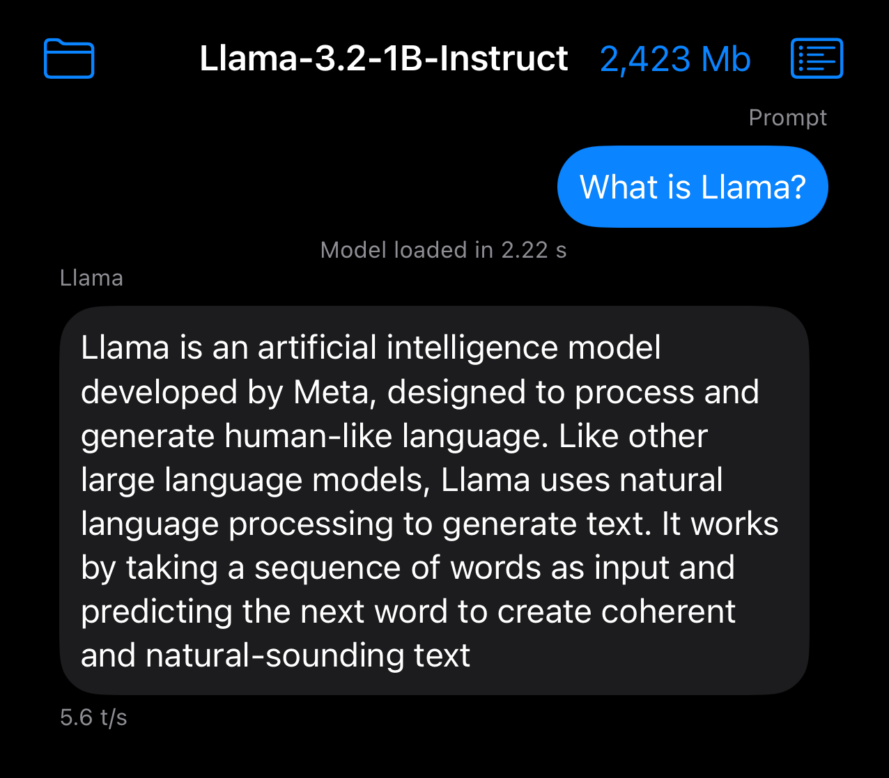

<div class="doc-header">
  <h1>ExecuTorch を使って iOS 上で Llama モデルを動かしてみた</h1>
  <div class="doc-author">栗山徹</div>
</div>

# ExecuTorch を使って iOS 上で Llama モデルを動かしてみた

## はじめに

本稿では、 ExecuTorch という、エッジ AI を実現するためのライブラリを題材に、エッジ AI や ExecuTorch の紹介、さらには ExecuTorch 付属のサンプルコードのうち、 Llama という Meta が開発している大規模言語モデル (LLM) を iOS デバイス上で動作させるサンプルを実行する方法について解説します。

筆者自身、iOS アプリにおける機械学習機能の組み込みには以前から興味はありましたが、実業務ではそこまで縁がありませんでした。したがって、本稿は iOS アプリ開発者、かつ機械学習初心者が iOS アプリに AI 機能を組み込む観点で執筆した記事となります。

なお、本稿は 2025 年 4 月 末時点の情報を元に執筆しました。

## エッジ AI について

**エッジ AI** とは、エッジデバイスと呼ばれるスマートフォンなどを含むネットワークにつながる端末で行う AI 関連処理 (学習・推論) のことです[^1]。エッジ AI に対して、クラウド上のコンピューティングリソースを利用して AI 処理を行うことを **クラウド AI**　と呼びます[^2]。

エッジ AI は IoT (Internet of Things) 技術の普及に伴い、注目されるようになりました。エッジ AI の代表的な事例としては自動運転技術が挙げられます。

[^1]: https://www.ntt.com/bizon/glossary/j-a/edge-ai.html

[^2]: https://business.ntt-east.co.jp/content/cloudsolution/column-240.html

### エッジ AI のメリット・デメリット

エッジ AI には後述するようなメリット・デメリットがあるため、実現したいことに対してエッジ AI が適しているかどうかについては慎重に見極める必要があります。

エッジ AI のメリットとしては、サーバーへの情報送信を必要とせず端末内で AI 処理が完結することから、セキュリティ面でのメリットやリアルタイム処理に適していることが挙げられます。特にセキュリティ面については、クラウド AI 系のサービスは送信した情報がどのように使われているのかが見えにくい点や情報漏洩のリスクがありますが、エッジ AI であればそもそもサーバーへデータを送信する必要が無いためより安全に AI 機能を利用できるメリットがあります。

一方、エッジ AI のデメリットとしては、エッジデバイスは性能に限界があり高度な AI 処理を実行するのには向いていないことや、エッジ AI で使用するモデル自体の漏洩リスクが挙げられます。エッジ AI ではエッジデバイスの性能限界もあり、学習済みモデルを組み込んで推論のみ実行するケースがほとんどです。 ChatGPT といった生成 AI 系のサービスは一般的には Web サービスとして提供されますが、これはモデルの漏洩リスクを防ぐのはもちろんのこと、生成 AI の推論処理を行うためには大量のコンピュータリソースを必要とするため、Web サービスとしての提供形態は理に適っているといえます。

エッジデバイスの制約により、エッジ AI では実現が難しいことはまだ多く存在します。一方で、エッジデバイスの性能は日々進化しており、特に GPU や Neural Engine の進化は目覚ましいものがあります。今後の性能向上により、より多くの AI 処理がエッジ AI で実現できるようになっていくのではないでしょうか。

### スマホアプリにおけるエッジ AI の活用事例

エッジ AI をスマホアプリに導入することで、ユニークなユーザー体験を実現することができます。ここでは、スマホアプリにおけるエッジ AI の活用実例として、 Apple Intelligence [^3]や Sansan のリアルタイム名刺認識技術[^4]について紹介します。

Apple Intelligence は、iPhone / iPad / macOS 上で生成 AI を活用した文章作成や画像生成を可能にする技術です (**図1**)。 エッジ AI のデメリットであるエッジデバイスの性能限界を Apple の AI サーバーや ChatGPT へシームレスに接続することで補っており、エッジ AI をスマホアプリに組み込む上で参考になる点が多々ありそうです。

一方、 Sansan のリアルタイム名刺認識技術は、エッジ AI がスマホアプリのユーザー体験向上に寄与する事例の一つといえます。 Sansan アプリや Eight アプリでは、名刺撮影時にカメラ映像内の名刺をリアルタイムに認識し、名刺が画面内にあることをユーザーに見せたり、撮影時に認識結果を元に写真から自動で名刺を切り出す機能があります。名刺画像を精度高く OCR するためには名刺画像の切り出しが必要で、リアルタイム名刺認識が実現したことでこれまで以上に OCR 結果を迅速に受け取ることができるようになり、ユーザー体験は劇的に向上しました。リアルタイム名刺認識を実現するため、 Core ML を利用して画像認識を行っています。

"){width=350}

[^3]: https://www.apple.com/jp/apple-intelligence/

[^4]: https://buildersbox.corp-sansan.com/entry/2022/11/01/110000

## PyTorch と ExecuTorch

エッジ AI の実現方法はいくつかありますが、本稿では ExecuTorch というライブラリに着目しました。 ExecuTorch は PyTorch をエッジデバイス向けに最適化したライブラリです。

### PyTorch について

**PyTorch** [^5]はオープンソースの機械学習ライブラリです。 PyTorch は TensorFlow [^6]と並んで機械学習機能の実装によく使われるライブラリのひとつです。名前のとおり Python 向けのライブラリですが、パフォーマンス向上を目的に C++ で実装されている箇所が多数あります。GPU を利用した処理の高速化や機械学習に便利な機能セットにより、多くの研究者や開発者に使用されています。

[^5]: https://pytorch.org/

[^6]: https://www.tensorflow.org/

### ExecuTorch について

**ExecuTorch** [^7]はエッジデバイス上での推論処理を実現するために開発されたライブラリです。 ExecuTorch を利用することで、既存の PyTorch モデルをエッジデバイス向け最適化された形で導入することが可能です。

ExecuTorch の特徴のひとつとして、エッジデバイスのハードウェア機能を活用したパフォーマンス向上が挙げられます。 ExecuTorch では推論を行う際に使用するバックエンドを選択することができ、iOS では Metal Performance Shader ( MPS ) および CoreML を選択でき、 Android では Vulkan を選択できます。スマートフォンに搭載されている GPU や Neural Engine を活用できることは、推論処理を行う上で大きなメリットがあります。

[^7]: https://pytorch.org/executorch-overview

#### PyTorch で生成された学習済みモデルを ExecuTorch で使用するには

ExecuTorch はエッジデバイス用に最適化されているため、PyTorch で生成された学習済みモデル ( PyTorch モデル) を ExecuTorch でそのまま実行できないことに注意してください。

"How ExecuTorch Works" [^8]という ExecuTorch の内部構造を解説したドキュメントによれば、PyTorch モデルを実行するためには下記 3 つのステップが必要と解説されています。

1. PyTorch モデルをエッジデバイスでの実行に最適化してエクスポートする
2. エクスポートしたモデルを ExecuTorch 用のモデル ( ExecuTorch モデル) としてコンパイルする
3. ExecuTorch ランタイムを用いて ExecuTorch モデルをインポートし推論処理を実行する

本稿で題材となっている Llama については 1. と 2. のステップをコマンド 1 つで処理できるツールが ExecuTorch のリポジトリに含まれており、 Python のコードを書くことなく容易に ExecuTorch モデルを出力できるようになっています。

[^8]: https://pytorch.org/executorch/stable/intro-how-it-works.html

## Llama について

**Llama (ラマ)** [^9]は Meta が開発した大規模言語モデル ( LLM ) です。Llama は最新の Llama 4 までの学習済みモデルがすべて公開されており、モデルをダウンロードした上でローカルで検証可能となっていることが大きな特徴です。ただ、 GPU をはじめ実行環境に高いスペックを要求されるため、ローカルでの実行は容易ではありません。

一方、 **Llama 3.2** に関しては軽量モデルとして提供されており、エッジデバイスでの利用を想定して開発されたモデルです。特に 1B と呼ばれる、モデルサイズが 10 億 パラメータのモデルについては、モデルファイルのサイズが 2.5 GB 程度しかなく、スマートフォンでなどのエッジデバイスでの実行も可能です。これは、パラメータ数が公開されている DeepSeek-V3 の 6710 億パラメータ[^10]と比べると小さなものですが、テキストに特化したモデルとすることでこれだけの小ささでも十分にテキストコミュニケーションを行うことが可能です。

配布されている　Llama の各モデルは PyTorch モデルとなっており、 ExecuTorch で使用するためには変換処理が必要となります。

後述するサンプルコードでは、 Llama 3.2 の 1B モデルを使用します。

[^9]: https://www.llama.com/

[^10]: https://api-docs.deepseek.com/news/news1226

## サンプルコードを動かしてみる

それでは、 ExecuTorch リポジトリ内にある Llama 3.2 のモデルを使ったチャットボットのサンプルコードを iOS 端末上で動かしてみましょう。サンプルコードは ExecuTorch のリポジトリにある "ExecuTorch Llama iOS Demo App" [^11]を使用します。なお、 ExecuTorch のバージョンは `0.6` を使用します。

[^11]: https://github.com/pytorch/executorch/tree/main/examples/demo-apps/apple_ios/LLaMA

### 執筆にあたり使用した環境について

執筆にあたり、下記環境を用いて検証を行いました。

#### ビルド環境

- MBP Pro (M2 Pro CPU, メモリ 16GB)
- macOS Sequoia (15.4)

#### 実行環境 (iOS)

- iPhone 13 Pro Max (ストレージ 256 GB, メモリ 6 GB)
- iOS 18.3

#### ソフトウェア

ビルド時に筆者の手元で使用したソフトウェアは下記のとおりです。

- Xcode: 16.2
- g++: 17.0.0 ( Xcode の Command Line Tools 付属の g++ を使用)
- asdf: 最新バージョン
- Python: 3.12.0
- ExecuTorch: 0.6

### ビルド手順

それでは、早速アプリをビルドするために必要なツールのインストールやモデルの変換を行いましょう。下記の順に進めていきます。

1. ExecuTorch のインストール
2. PyTorch モデルの変換に使用するツールをインストールする
3. Llama　3.2 1B モデルを取得する
4. Llama モデルを ExecuTorch 用のモデルへ変換してみる
5. LLaMA プロジェクトのビルドに必要な修正を行う

#### 1. ExecuTorch のインストール

ExecuTorch は下記 pip コマンドを用いて簡単にインストールできます。

```shell
pip install executorch
```

ただ、 Llama　のモデルを ExecuTorch 用のモデルへ変換するツールをインストールする関係で、今回は ExecuTorch をソースコードからインストールします。

ソースコードからのインストールは "Building from Source" [^12]に記載されている手順を見ながら進めていきます。

まずは ExecuTorch リポジトリを Clone してください。

```shell
git clone -b release/0.6 https://github.com/pytorch/executorch.git
cd executorch
```

インストールには `install_executorch.sh` を使用します。以下のコマンドを実行してください。

```shell
./install_executorch.sh --pybind xnnpack mps coreml
```

`--pybind` オプションですが、 ExecuTorch 実行時に選択可能なバックエンドの設定となります。本稿では xnnpack [^13]のみ使用しますが、今後 mps ( Metal Performance Shaders ) や coreml ( coreML ) を利用する可能性があるので、全て指定してビルドを行います。

install_executorch.sh が正常終了したら、ビルドとインストールは成功です。

[^12]: https://pytorch.org/executorch/0.6/using-executorch-building-from-source.html

[^13]: CPU 上での推論処理を最適化するためのライブラリです。詳細は https://github.com/google/XNNPACK をご覧ください。

#### 2. PyTorch モデルの変換に使用するツールをインストールする

前述のとおり、 Llama のモデル を ExecuTorch で使用するためには ExecuTorch モデルへの変換が必要です。変換に必要なツール一式をインストールしましょう。

ExecuTorch の GitHub リポジトリに Llama 関連のツールが格納されたディレクトリ (`examples/models/llama/`) があります[^14]。ディレクトリ内に `install_requirements.sh` というスクリプトがあるので、こちらのスクリプトを実行するとインストールが開始されます。

```shell
sh ./examples/models/llama/install_requirements.sh
```

install_requirements.sh が正常終了したらインストールは完了です。

[^14]: https://github.com/pytorch/executorch/blob/v0.6.0/examples/models/llama

#### 3. Llama　3.2 1B モデルを取得する

次に、サンプルアプリで使用する Llama　3.2 1B モデルを取得します。 Llama のサイト (https://www.llama.com/) へアクセスし、右上にある "Download models" からダウンロードできます。氏名やメールアドレスなどの必要事項を入力を上、ダウンロードしたいモデルを選択します。今回は "Llama 3 models" の "Llama 3.2: 1B & 3B" という名前のモデルを使用するので、チェックを入れて画面下の "Next" ボタンを押してください。規約に同意すると、 CLI を使用したモデルのダウンロード手順が表示されるので、指示に従ってダウンロードします。

まずはダウンロードに使用する llama コマンドを pip コマンドを使ってインストールします。

```shell
pip install llama-stack
```

インストールできたら、モデルをダウンロードします。モデルのダウンロードにあたって、必要な情報が 2 つあります。

- MODEL_ID
- custom URL

MODEL_ID について、今回は "Llama3.2-1B-Instruct" [^15]というモデルを使用するため、 MODEL_ID は `Llama3.2-1B-Instruct` を指定します。 custom URL については、ダウンロード手順の中の "Specify custom URL" の中に発行から 48 時間有効な URL が記載されているので、こちらを使用します。

2 つの情報が取得できたら、以下のコマンドを実行してダウンロードします。

```shell
llama model download --source meta --model-id  Llama3.2-1B-Instruct
```

実行途中で URL の入力を求められるので、先ほどの custom URL を入力します。 `~/.llama/checkpoints/Llama3.2-1B-Instruct/` ディレクトリにサンプルコードで使用する "consolidated.00.pth" と "tokenizer.model" "params.json" という 3 種類のファイルが存在していれば、ダウンロード成功です。

[^15]: Instruct モデルはベースとなるモデルを Instruction Tuning (指示プロンプトへ適切に応答できるようチューニング) したモデルです。

#### 4. Llama モデルを ExecuTorch 用のモデルへ変換してみる

モデルのダウンロードが完了したら、ダウンロードしたモデルを ExecuTorch 用のモデルへ変換しましょう。下記コマンドを実行してください。 .pth ファイルと params.json のパスは適宜読み替えてください。

```shell
python -m examples.models.llama.export_llama \
  --model "llama3_2" \
  --checkpoint "path/to/consolidated.00.pth" \
  --params "path/to/params.json" \
  -kv \
  --use_sdpa_with_kv_cache \
  -d bf16 \
  --metadata '{"get_bos_id":128000, "get_eos_ids":[128009, 128001]}' \
  --output_name="Llama-3.2-1B-Instruct.pte"
```

カレントディレクトリに `Llama-3.2-1B-Instruct.pte` という 2.5 GB 弱のファイルが出力されていたら、変換成功です。

##### 変換したモデルの動作確認を行う

アプリに組み込んで動作確認を行う前に、 Validation Tool を利用してモデルの動作確認を行いましょう。

まずは Validation Tool のビルドに必要なライブラリのビルドを行います。 ExecuTorch リポジトリの root ディレクトリで下記コマンドを実行してください。

```shell
cmake -DPYTHON_EXECUTABLE=python \
    -DCMAKE_INSTALL_PREFIX=cmake-out \
    -DEXECUTORCH_ENABLE_LOGGING=1 \
    -DCMAKE_BUILD_TYPE=Release \
    -DEXECUTORCH_BUILD_EXTENSION_DATA_LOADER=ON \
    -DEXECUTORCH_BUILD_EXTENSION_MODULE=ON \
    -DEXECUTORCH_BUILD_EXTENSION_TENSOR=ON \
    -DEXECUTORCH_BUILD_XNNPACK=ON \
    -DEXECUTORCH_BUILD_KERNELS_QUANTIZED=ON \
    -DEXECUTORCH_BUILD_KERNELS_OPTIMIZED=ON \
    -DEXECUTORCH_BUILD_KERNELS_CUSTOM=ON \
    -Bcmake-out .

cmake --build cmake-out -j16 --target install --config Release
```

成功したら、今度は Validation Tool のビルドを行います。下記コマンドを実行してください。

```shell
cmake -DPYTHON_EXECUTABLE=python \
    -DCMAKE_INSTALL_PREFIX=cmake-out \
    -DCMAKE_BUILD_TYPE=Release \
    -DEXECUTORCH_BUILD_KERNELS_CUSTOM=ON \
    -DEXECUTORCH_BUILD_KERNELS_OPTIMIZED=ON \
    -DEXECUTORCH_BUILD_XNNPACK=ON \
    -DEXECUTORCH_BUILD_KERNELS_QUANTIZED=ON \
    -Bcmake-out/examples/models/llama \
    examples/models/llama

cmake --build cmake-out/examples/models/llama -j16 --config Release
```

ビルドが成功したら、 `cmake-out` ディレクトリ内に `llama_main` という実行ファイルが生成されるので、早速動作確認を行います。下記コマンドを実行してください。

```shell
cmake-out/examples/models/llama/llama_main \
    --model_path=path/to/Llama-3.2-1B-Instruct.pte" \
    --tokenizer_path=path/to/tokenizer.model  \
    --prompt="What is Llama?"
```

`--prompt` オプションに試してみたいプロンプトを入力してください。実行結果の中に、 Llama 側からの応答が含まれていれば成功です。下記に応答部分を抜粋した出力結果を掲載します。

>lama is an AI developed by Meta, Peter Thiel, Dustin Moskovitz, and Max Levchin. Llama is a large language model developed for conversational purposes and is designed to be more human-like and contextual. It can answer questions, provide definitions, and even create text. Llama is multi-lingual, meaning it can respond in multiple languages. Currently, Llama can converse in English, Spanish, French, German, Italian, Dutch, Russian, and Hindi. In the future, Llama may be able to support more languages. 
>
>Llama is pre-trained on a massive corpus

なお、 LLM の応答にはランダム性があるため、同じ質問をした場合でも出力は一致しないことに注意してください。同じ内容で再度コマンドを実行したところ、今度は下記のような出力を得ました。

>lama is an artificial intelligence that can help with a variety of tasks. It can answer questions, provide information, and even generate text. It's always happy to chat with you. Is there anything I can help you with?<|eot_id|>

それらしい応答が得られれば動作確認としては OK とします。

#### 5. LLaMA プロジェクトをビルドする

モデルの準備もできたので、いよいよ iOS アプリのサンプルコードをビルドして動かしてみましょう。サンプルコードは ExecuTorch リポジトリの `examples/demo-apps/apple_ios/LLaMA` にあります。 `LLaMA.xcodeproj` をオープンし、ビルドが成功すればシミュレータまたは実機にインストールされ、アプリが起動するはずです。

…と簡単に書いたものの、筆者はプロジェクトを開いてすぐにビルドできたわけではありませんでした。ここでは筆者が遭遇したトラブルと解決策について紹介します。

##### LLaMaRunner の Build Cmake Dependencies の実行に失敗する

筆者の環境では "Cmake が 見つからない" 旨のエラーが出ていました。環境によってはこのようなエラーが出ることはないかもしれませんが、もし同様のエラーが出るようであれば、 "Build Cmake Dependencies" のスクリプト内で Cmake への PATH を追加しましょう。 Homebrew で Cmake をインストールした場合は下記 1 行を追加してください。

```shell
PATH="/opt/homebrew/bin:$PATH"
```

##### Xcode のプロジェクト内で llama_tiktoken.cpp および llama_tiktoken.h が見つからない

おそらく、当該ファイルを移動させた際に Xcode のプロジェクト側の設定を変更していなかったものと思われます。

当該ファイルは `examples/models/llama/tokenizer` 内にあるので、パスを修正することでビルドが通るようになりました。

##### 実機ビルドに失敗する

"Signing & Capabilities" の Provisioning Profile を変更するだけの話ですが、 1 点だけ気をつけなければならないことがあります。

LLaMA のプロジェクトでは "Increased Memory Limit" Entitlement を利用しています。これは iPadOS におけるメモリ使用量上限を引き上げるための Entitlement になります。

App ID を作る際には Increased Memory Limit のチェックを忘れずに行ってください。

### サンプルコードを動かしてみた

それでは、サンプルコードを実行してみましょう。アプリを起動すると、チャット画面風の UI が表示されます。ただ、このままだとプロンプトの入力ができません。 Llama からの応答を得るためには、 Validation Tool 実行時に指定したモデル (.pte) と Tokenizer ファイル (.model) が必要になります。シミュレータまたは実機のローカルフォルダ内にこれら 2 ファイルをコピーします。

コピーしたら、画面左上のフォルダアイコンをタップします。 "Select Model..." と "Select Tokenizer..." という 2 つのボタンがあるので、それぞれ .pte ファイルと .model ファイルを指定します。

ここまで完了したら、先ほどの Validation Tool 実行時と同じプロンプト ("What is Llama?") を入力してみたところ、 **図2** のような出力となりました。

{width=400}

概ねそれらしい出力になることが確認できました。

なお、右上に "2,423MB" という記載がありますが、これは現在 LLaMA アプリが使用しているメモリサイズになります。 LLM を実行するためには大量のメモリが必要となることがお分かりいただけると思います。

## まとめ

本稿では、ExecuTorch というエッジ AI を実現するためのライブラリを題材に、エッジ AI と ExecuTorch の紹介や、実際に ExecuTorch リポジトリ内の iOS サンプルアプリをビルドする手順について紹介しました。

メモリ使用量やモデルファイルのサイズなど、実用的なオンデバイス LLM のためにはまだまだ課題が多いことがわかりました。一方で、エッジデバイスでも LLM をスタンドアローン実行でき、かつある程度の精度は出せることもわかりました。エッジデバイス、および ExecuTorch と LLM モデルの性能向上は今後も期待できることから、性能が向上するにつれて、実用的な利活用の可能性が広がっていくことが予想されます。

一方、活用事例でも紹介したように、 LLM 以外のエッジ AI については既に実用化もある程度進んでいる状態です。 ExecuTorch は PyTorch との親和性が高く、かつ iPhone や Android 端末の GPU を利用して高速に推論処理を行う仕組みもあることから、 ExecuTorch は今後導入事例が増えていくのではないでしょうか。

<hr class="page-break" />
