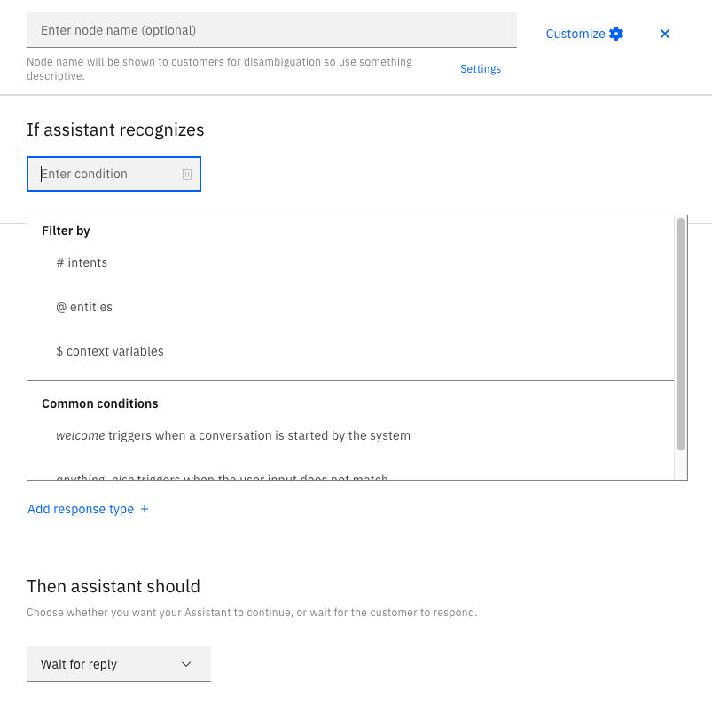
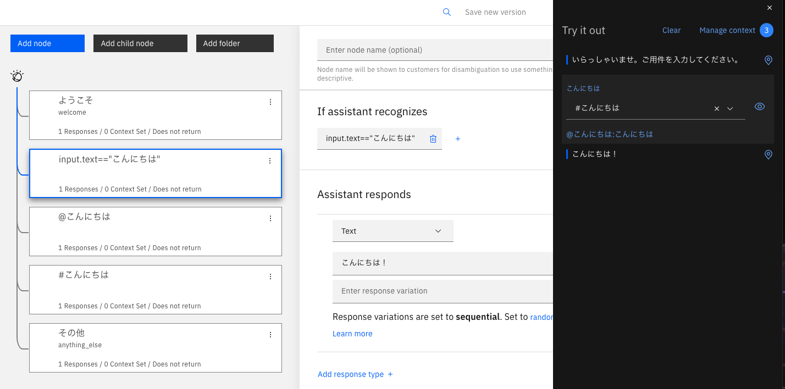
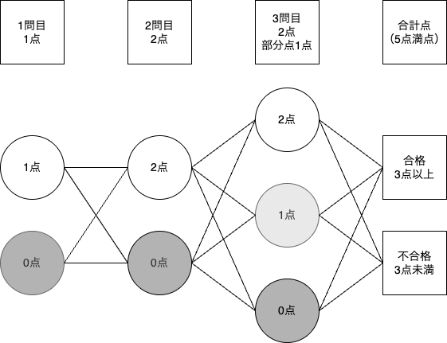
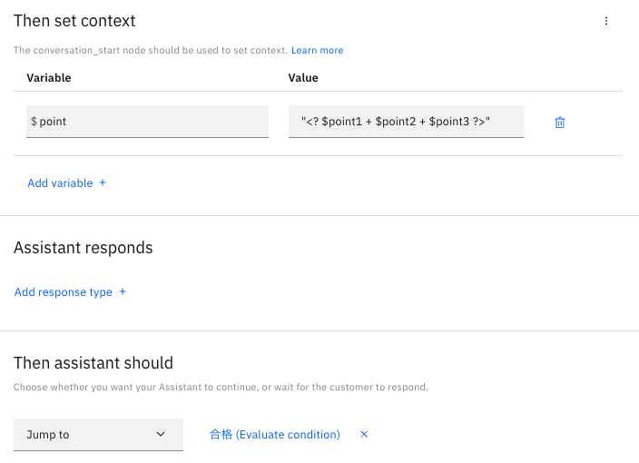

  <h1>1時間でできるIBM watsonx Assistantのシナリオ構築</h1>
  
Koty

## 1. watsonx Assistantとは？

### 対話型AIチャットボット
IBMの公式説明によると、IBM watsonx Assistantは、組織の誰もが簡単に生成AIアシスタントを作成できる次世代の対話型AIソリューションです。
https://www.ibm.com/jp-ja/products/watsonx-assistant
AIというと若干今のご時世、誤解を招く部分もあるのですが、ChatGPTなどの生成AIと異なり、watsonxの内部にAI部分は存在するものの、作業者によって正解を緻密に設計することで、いわゆる生成AIと異なり、「それらしい文章の中に嘘を紛れ込ませるミスを出さない」という点において優れていると私は感じています。

また、IBM watsonx Assistantの管理画面を見て数ヶ月経つと、あれ？ こんな機能あったっけ？ こんな画面だったっけ？
ということが多々見受けられるので、日々改善を続けているサービスだとも感じています。
注:サービス名称もWatson Assistantからwatsonx Assistantに変更されたため、一部ではまだ公式画面上にも「Watson」表記が残っているくらいです。

### チャットボットとは
チャットボットは海外ではChatterbotなどと呼ばれ、「Chat（おしゃべり）」「Bot（ロボットの略）」つまり、自動で人間のようにおしゃべりをしてくれる存在です。
watsonx AssistantはAI非搭載チャットボットと同じ感覚で、作業者の設計したシナリオに基づいて会話を行います。

### AI非搭載チャットボットの特徴

AI非搭載のチャットボットはChatGPTやGrok同様、即時、いつでもレスポンスは可能ではありますが、それらと最も大きく異なる点として、以下の苦手タスクが存在します。

#### 苦手なこと
- **複雑な質問の解決**: 多数の質問を同時にすると、どれか1つのみへの回答をしてしまう
- **メンタルフォロー**: 登録外の言い換えはわからないため、行間を読むことができない

これらの苦手があっても生き残っている理由として、先にあげた「AI自身で嘘をつけない」良さが実はあるのです。
- 生成AIに色々教えて、ミスを減らす調教をし、自在に回答を生成をさせるチャットボット
- 答えさせる内容は確実に決め、答えられない内容も存在するが、嘘だけは回答しないチャットボット
どちらが良いチャットボットであると言えるのか、それはチャットボットで提供したい内容次第です。
（あるいは、watsonxを頭脳とした箱側のチャットボットが別途ある前提で、watsonxと生成AI、双方をチャットボットに連携する開発をすることもできます。watsonxで基本的には答えさせておき、答えが見つからない場合に一定の不確実性が紛れ込む前提で接続先を生成AIに切り替え、生成AIに答えをバトンタッチすることも理論上可能ですが・・・）

私は昔ながらのチャットボットの良さも知ってもらうべく、この記事を執筆することにしました。

## 2. watsonx Assistantでのチャットボット構築手順

### チャットボット（IBMでの名称：Skill）の作成
1. 以下管理画面にログイン（アカウント作成手順は割愛させていただきます）
https://us-south.assistant.watson.cloud.ibm.com/
※こちらは私が誤って作成時にアメリカゾーンにアカウントを作成してしまったためで、日本ゾーンに作った場合は「us-south」の場所が「jp-tok」となります。
2. 黒色のCreate Skillボタンをクリック
3. Dialog skill（3つボタンがある真ん中）にチェック
4. Nextをクリック
5. 図1のフォームに以下を入力
   - Name: 任意の名前（管理画面および、ダウンロードした際に表示されるSkillの名称となります）
   - Description: （特に記入必須ではありません。何か説明を書きたければどうぞ）
   - Language: Japanese
※日本語でチャットボットを設計したい場合、ここでJapaneseを選ばないと（JSON上で書き換える方法はあるのですが）AI認識部分で問題が生じるため、必ずプルダウンからJapaneseをご選択ください。
6. 青色に活性化されたCreate skillボタンをクリック

## 3. 対話の設計

### チャットボット初期状態
初期状態で左カラムのメニューから「Dialog」をクリックすると、以下の2つのnodeが作成されています。

#### Welcome
- 条件に「welcome（初めてチャットボットを開いた時に自動的に表示される言葉）」が設定されている

#### Anything_else
- 条件に「anything_else（何のテキストが入力されても反応する）」が設定されている
- 視覚的な意味においてAnything_elseより上の場所に設置しているnodeで入力語句と見合わない場合、強制的にこのnodeに書かれた内容が表示される
- つまり、このnodeの下にnodeを設置しても、そのnodeは反応することがない

なお、nodeとはチャットボットのシナリオを書き込む構成単位であり、1つのnodeには基本的に1つのメッセージ（内容）を書き込むことが推奨されます。
このnodeを組み合わせていくことで、チャットボットが完成します。

### nodeの追加方法
- パターン① nodeより上にある青いボタンの「Add node」を押す
- パターン② 既存nodeの縦3点リーグをクリック。次のいずれかを選択
   - 「Add node below（下に作る）」
   - 「Add node above（上に作る）」
   - 「Add child node（子の位置に作る）」

### nodeの削除方法
1. 削除したいnodeの縦3点リーグをクリック
2. 「Delete」を選択

### nodeの基本設定
シンプルなチャットボットを作成する場合、各nodeには大きく以下の4点（3点？）を設定するだけで問題ありません。
1. **Enter node name（名前）**: 必須ではないが、後で混乱しないように内容に即した名前をつけると多少便利
2. **If assistant recognizes（一致条件）**: どんな入力があった場合に呼び出すことができるか（図2）
※前述のwelcomeとanything_elseの他、反応させたい精度と条件により、上記画像のFilter byを含めた4種類のセット方法があります

3. **Assistant responds（文章、画像など）**: チャットボットの回答本体
4. **Then assistant should（次の動作）**: ユーザーに対してどのようにnodeが次に動くか設定する
   - Wait for reply（ユーザーが入力するまで何もしない）※基本的にはこちらで問題なし
   - Jump to（ユーザーが何もしなくても、勝手に指定先のnodeに飛んで同時に表示させる）

＜図2＞

## 4. If assistant recognizesの設定方法
### 例① : 完全一致
`input.text== "こんにちは"`
- 単語ベースで捉える仕組みです。特定の単語のみ認識して、完全一致した場合のみ応答します。
  

＜図3＞

### 例② : 部分的一致
 `@`entities
- 単語ベースで部分的に捉える仕組みです。特定の単語や語句を認識して、それが入力語句に含まれている場合に応答します。

#### 特徴
- **メリット**:
  - 出力を制御しやすい
- **デメリット**:
  - 言葉の揺らぎへの柔軟性がほぼない
  - 視覚的に上位にあるnodeが出力される（より近い意味では選ばれない）

#### 設定方法
1. My Entitiesを選択
2. Create entityをクリック
3. entityに名前をつける（例: @挨拶）
4. 再度現れるCreate entityをクリック
5. Valueと類義語を登録
   - 例: 「こんにちは」の類義語として「コンニチハ」「こんばんは」などを登録
   - 注：Entity nameの部分はタイトルなので、ここに書いた語句は画像下のValuesまたはsynonimsに登録しないと反応しないことに注意（私が初学者の時、よくしたミスです。セットしたのに反応しない！！とパニックになっていました。ここで名前だけを「挨拶」にし、「挨拶」と入力した場合は反応しないので、うっかりを防ぐためには中身に含まれている語句を使う方が危なくないですね……）
     

＜図4＞

#### Dialogでの使用
- 条件に `@entity name` を指定
- セット例は後ほどまとめて後述します。

### 例③ : 全体的な意味合いの一致
`#`intents
- 全体を意味で捉える仕組みです。ユーザーの発言の意図を理解して応答します。

#### 特徴
- **メリット**:
  - 言葉の揺らぎへの対応が柔軟
  - 送り仮名や活用形の揺らぎにも対応
- **デメリット**:
  - 関連していないのに間違って出力される可能性がある
  - 登録し過ぎると出やすい偏りが出る（確率で出すなど高度な技術を使う時に顕著です）

#### 設定方法
1. Intentsを選択
2. Create intentをクリック
3. intentに名前をつける（例: #挨拶）
4. 再度現れるCreate intentをクリック
5. 例文を複数登録（3〜4例が望ましい）
   - 例: 「おはようございます」「こんにちは」「こんばんは」など
     

＜図5＞

#### Dialogでの使用
- 条件に `#intent name` を指定
- セット例は後ほどまとめて後述します。

### entitiesとintentsのセット例
＜図4＞をentityにセットしている状態で「コンニチハ〜」とチャットボットに入力します。
「コンニチハ〜」の中には「コンニチハ」がセットしてあるため、チャットボットがentityをセットしたnodeに反応します。
`input.text== "こんにちは"`
とは語句が完全一致しないため（コンニチハでもNG）、そのnodeには引っかかりません。

＜図6＞

なお、ここで図1の説明の際の伏線が回収されます。
実は、これは「Japanese」を選んでいるので「コンニチハ〜」でも「コンニチハ」が含まれていると分かり、反応しますが、例えば「English」を選ぶと単語の切れ目がどこか分からなくなり、「コンニチハ〜 ≠ コンニチハ」とwatsonx assistantのAIに判定されて、反応しなくなるのです。ですので、チャットボットを組む言語を選択するのは非常に重要です。
watsonx assistantにもAIはいるのです。

さて、＜図5＞をintentにセットしている状態で「こんちは」とチャットボットに入力します。
「こんにちは」を登録しており、意味合いとしては近い（文字の並びとして近いという判断もある）のでintentをセットしたnodeが反応します。

＜図7＞

ただし、watsonx assistantのAIも完璧ではないので、「こんにちわ」だと急に分からなかったりします。
ここでは当てはまらない言葉を拾い上げる目的のanything_alse nodeが反応してしまっています。

＜図8＞

ですので、色々な言い回しをintentsには予め登録しておくことを推奨します。

## 5. Assistant respondsの種類
チャットボットの回答本体となり得る部分を少し紹介します。基本的には後述する3点を覚えてもらうと、基本的なチャットボットは一通り構築が可能です。

＜図9＞

### 文章
1. Assistant respondsの初期設定プルダウンのまま「Text」
   - 入力した見た目のままのテキストメッセージを返すことができる
   - 制限文字数は4096文字

### 選択肢
1. Assistant respondsの初期設定プルダウンから「Option」を選択
2. Titleに質問文を入力（例: あなたの名前は何ですか？）
   - 他の場所から文章を貼り付けると改行が半角スペースに変換されてしまうため、改行を入れたい場合はJSONツールを開いて改行記号を入れる必要がある
   - 制限文字数は512文字
3. List label（見た目のテキスト）とValue（送信されるテキスト）を設定（図10）
   - 基本的には、List labelとValueは同じテキストにする方が好ましい（違う文字が選択した選択肢として表示されるとユーザーが混乱するため）
   - 制限文字数は512文字
   - Webページを開く設定にしたい場合はValueに遷移させたいURLを入力する
4. 選択肢を作る場合は、必ず子node（選択肢を選んだ場合に反応するnodeのこと）が必要となる
上記のnodeの追加方法で「Add child node」を選択
5. child node側でそれぞれの選択肢に対する一致条件を設定（図11）
   - 条件: `input.text== "田中"` 
   - 条件: `input.text== "佐藤"` 
   - 条件: `input.text== "高橋"` など

＜図10＞

v
＜図11＞

### 画像
1. Assistant respondsの初期設定プルダウンから「Image」を選択
2. Title（画像と一緒に出力されるメッセージ、省略可）を入力
3. Image sourceにhttpsから始まる画像URLを指定する

## 5. Contextの概念
今まではどのような条件でチャットボットを反応させるかについて述べてきましたが、contextは、記憶させておき、後で取り出すことで有用な概念です。突入条件としても使えます。
会話の流れに沿って、様々なユーザーデータをチャットボットに記憶させるために利用されます。

### Contextでできること
- こちらで設定した選択肢をユーザーが選んだ場合に情報を記憶させる
- 覚えさせた記憶は上書きすることもできる
- 覚えさせた記憶は忘れさせることもできる
- 上記の内容は全てこちらの設定次第で、勝手に忘れたり変わることはない

### Contextの設定方法
1. Open context editorを選択（図12）
2. Variable（変数名）とValue（値）を設定
   - 変数名は `$` で始まる（例: `$name`）
  

＜図12＞

### ヒアリングシナリオの構築
1. ユーザーから情報を得る
   - Assistant responds右にある縦3点リーグから、Open context editorを選択
   - Then set contextフォームに以下入力
      - Variable: 変数名（例: `name`）
      - Value: 値（例: `<? input.text ?>``1`）
      - 直接ユーザーが入力した語句をそのまま覚えさせたくない時は、一旦child nodeを挟むなど工夫が必要
2. その変数名に対応するContextに自動保存される
3. 保存した情報を取り出して表示
   - 例：回答内で `<? $name ?>さん、よろしくお願いします`

### 計算式シナリオの構築
これを上手く使うと、チャットボットに計算をさせることも可能です。
仮に5点満点で、3点以上合格の問題を設計することにします。

＜図13＞

その場合、以下のような設計になります。
1. 回答に点数を与える
2. 合計点を計算
3. 結果に応じて回答を分岐

#### 全体のツリー図

＜図14＞

#### 1問目子node

＜図15＞

#### 最後の計算

＜図16＞

#### 分岐例

＜図17＞

### 非エンジニアへのTips
- `==` : 一致する
- `!=` : 一致しない
- `>` : より大きい
- `<` : より小さい
- `>=` : 以上
- `<=` : 以下
- `+` `-` `*` `/` : 四則演算

長々とお読みいただき、ありがとうございました。
これらの内容をサクッと理解し、実装いただければ1時間で簡単なチャットボットは出来る筈……！
皆様、良きチャットボットライフを。

その他、詳しい式言語のメソッドは、公式が一番分かりやすく記載しています。
以下、ご参考いただくと良いかと思います。
https://cloud.ibm.com/docs/watson-assistant?topic=watson-assistant-expression-methods-actions&locale=ja

お読みいただきありがとうございました。
