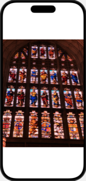
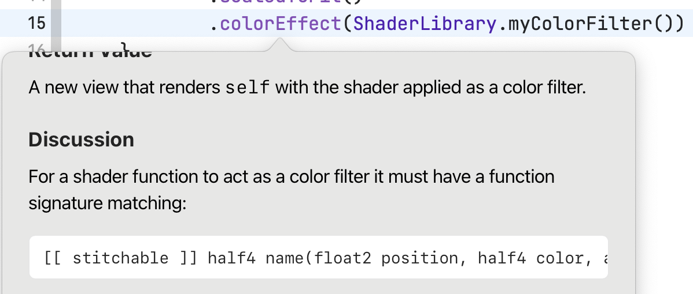

<div class="doc-header">
  <h1>知っているとちょっと嬉しいMetalの話</h1>
  <div class="doc-author">成瀬 未春（みはるん）</div>
</div>

# 知っているとちょっと嬉しいMetalの話

4月に開催されたtry! Swift Tokyo 2025では、Metal関連のトークがいくつもありましたね。
普段見慣れないSwiftではない言語が出てきたので、少し抵抗感を持ってしまった方もいれば、この機会にもっと知りたいと思った方もいるのではないでしょうか？
あるいは、この記事ではじめてMetalについて目にしたという方もいるかもしれませんね。

この記事では、そんなMetalについて学ぶ上で、知っているとちょっと嬉しいんじゃないかなという話を書いていきます。少しでもお役に立てれば幸いです。

## Metalシェーダーで何ができるの？

Metalとは、Appleが開発した、グラフィックス処理や並列計算を行うための低レベルなAPIです。
Metalを活用することで、次のような表現が実現できるようになります（ほんの一例です）。

### ① 色操作

| Before | After |
| --- | --- |
|||

### ② 歪み効果

| Before | After |
| --- | --- |
|||

### ③ レイヤーの合成

| Before | After |
| --- | --- |
|||

<hr class="page-break" />

## iOS 17の新機能 “3大VisualEffect”を紹介

iOS 17では、SwiftUIにMetalというグラフィックスAPIが統合され、開発者はより低いレベルでグラフィック処理を制御し、より高度な視覚効果を実装できるようになりました。

このセクションでは、iOS 17で導入された `VisualEffect` の拡張機能を中心に、SwiftUIとMetalの連携による新しい表現を見ていきましょう。

### SwiftUIとMetalの融合: `Shader` 型の導入

iOS 17では、SwiftUIに新たな型である `Shader` が導入されました。これは、Metal Shading Language（MSL）で記述されたGPU向けのプログラムを、SwiftUIのコード内で直接扱えるようにするしくみです。

`Shader` 型を活用することで、画面上のピクセル単位での色操作、画像の歪み、複数のレイヤーの合成といった高度なグラフィック処理を、宣言的なSwiftUIの構文の中で実現できます。

### `VisualEffect` のExtension: 3つの主要なエフェクト

iOS 17では、 `VisualEffect` プロトコルに3つの新しいメソッドが追加されました。これらは、 `Shader` 型と連携し、さまざまな視覚効果をビューに適用するために使用されます。

それぞれのメソッドから呼び出されるMSLは、metalファイルに記述します。


<hr class="page-break" />

### ① ピクセル単位の色操作 `colorEffect(_:isEnabled:)`

ピクセル単位で色フィルタを適用します。提供されたシェーダー関数は、各ピクセルの位置情報（ `float2 position` ）と入力色（ `half4 color` ）を受け取り、加工後の色（ `half4` ）を返します。

.swiftファイルに記述します:

```swift
import SwiftUI

struct ColorFilterView: View {
    var body: some View {
        Image(.myImage)
            .colorEffect(ShaderLibrary.myColorFilter())
    }
}
```

.metalファイルに記述します:

```cpp
#include <metal_stdlib>
using namespace metal;

[[ stitchable ]] half4 myColorFilter(float2 position, half4 color) {
    // 赤色成分を強調するフィルタ
    return half4(color.r * 2.0, color.g, color.b, color.a);
}
```

<hr class="page-break" />

### ② 画像の歪み効果 `distortionEffect(_:maxSampleOffset:isEnabled:)`

ピクセルの位置を操作することで、歪み効果を生み出します。シェーダー関数は、描画対象の出力ピクセルの位置（ `float2 position` ）を受け取り、描画に使用する入力ピクセルの位置（ `float2` ）を返します。つまり、現在の描画位置に、元の画像のどの部分を配置するかを指定します。

`maxSampleOffset` は、シェーダーが参照する元の画像上の位置が、現在のピクセル位置からどれくらい離れる可能性があるかの最大距離を示します。これは、画像をどれだけ大きく歪ませるかの目安となり、処理の最適化にも使われます。

```swift
import SwiftUI

struct WaveDistortionView: View {
    var body: some View {
        Image(.myImage)
            .distortionEffect(
                ShaderLibrary.waveDistortion(),
                maxSampleOffset: .init(width: 0, height: 10)
            )
    }
}
```

```cpp
#include <metal_stdlib>
using namespace metal;

[[ stitchable ]] float2 waveDistortion(float2 position) {
    // x方向に波を適用して、y座標を上下に揺らす
    float wave = sin(position.x * 0.1) * 10;
    return float2(position.x, position.y + wave);
}
```

<hr class="page-break" />

### ③ レイヤーへの効果適用 `layerEffect(_:maxSampleOffset:isEnabled:)`

ビューの内容を一旦ラスタライズ（＝ピクセル単位に変換）したレイヤーに対してフィルタを適用します。シェーダー関数は、描画対象の出力ピクセルの位置（ `float2 position` ）と、 `SwiftUI::Layer` 型のレイヤーオブジェクトを受け取ります。レイヤーオブジェクトの `sample(float2)` メソッドを使って、指定した位置の色情報を取得し、加工することができます。

`maxSampleOffset` は、「②画像の歪み効果」の説明と同じです。

```swift
import SwiftUI

struct ChromaticAberrationView: View {
    var body: some View {
        Image(.myImage)
            .layerEffect(
                ShaderLibrary.chromaticAberration(),
                maxSampleOffset: .init(width: 5, height: 5)
            )
    }
}
```

```cpp
#include <metal_stdlib>
#include <SwiftUI/SwiftUI.h>
using namespace metal;

[[stitchable]] half4 chromaticAberration(float2 position, SwiftUI::Layer layer) {
    // RGBのチャンネルごとに表示位置をわずかにずらす
    float2 offsetR = float2(5.0, 5.0);
    float2 offsetG = float2(0.0, 0.0);
    float2 offsetB = float2(-5.0, -5.0);

    half4 colorR = layer.sample(position + offsetR);
    half4 colorG = layer.sample(position + offsetG);
    half4 colorB = layer.sample(position + offsetB);

    return half4(colorR.r, colorG.g, colorB.b, (colorR.a + colorG.a + colorB.a) / 3.0);
}
```

## シェーダー関数には引数があるのに、SwiftUIから引数を渡さなくていいってどういうこと？

`colorEffect(_:isEnabled:)` を使ったコードを見て、「あれ？MSLで定義したシェーダー関数には、`float2` の位置情報や `half4` の色情報といった引数があるのに、SwiftUIから使うときには、なぜ引数を指定しないんだろう？」と不思議に思いませんでしたか？

例えば、ピクセル単位の色操作を行う `colorEffect(_:isEnabled:)` のシェーダー関数の中を見てみると、

```cpp
[[ stitchable ]] half4 myColorFilter(float2 position, half4 color)
```

のように、 処理するピクセルの位置を表す `float2` と、そのピクセルの元の色を表す `half4` が、引数としてしっかりと定義されています。しかし、SwiftUIで実際にこのシェーダーを適用する際には、

```swift
.colorEffect(ShaderLibrary.myColorFilter())
```

のように、引数がどこにも見当たりません。

これは、SwiftUIが裏で賢くやってくれているおかげなんです。 `colorEffect` の場合、画面の各ピクセルに対して色変換を行うためには、「今、どのピクセルを処理しているのか」という位置情報と、「そのピクセルの元の色情報」が絶対に必要になります。SwiftUIは、このような基本的な入力を、開発者が明示的に記述しなくても、シェーダー関数が実行される際に自動的に渡してくれるしくみを持っているのです。

このしくみは `distortionEffect` と `layerEffect` も同様で、それぞれの機能で必要不可欠な情報が、自動的にシェーダー関数に渡されるように設計されているのです。


<hr class="page-break" />

## それぞれの `VisualEffect` に対応するシェーダー関数のシグネチャなんて覚えてられないよ！

`colorEffect` 、 `distortionEffect` 、`layerEffect` といった `VisualEffect` のそれぞれでシェーダー関数を使いますが、それぞれシグネチャが違うことに気がつきましたか？

「まさか全部覚えるの...？」

そんな必要はありませんのでご安心ください。

シェーダー関数のフォーマットは、それぞれの `VisualEffect` に対応して、公式のドキュメントに記載されているんです。一番手っ取り早いのは、XcodeのQuick Helpを見る方法です。

例えば、 `colorEffect(_:isEnabled:)` で使用できるシェーダー関数のシグネチャを知りたい場合、Xcodeのエディタで `.colorEffect` と記述し、Quick Helpを見ると、この `colorEffect` で使用できるシェーダー関数の基本的な形式が記載されているはずです。

```
For a shader function to act as a color filter it must have a function signature matching:
[[ stitchable ]] half4 name(float2 position, half4 color, args...)
```



<hr class="page-break" />

## Metal主要トピック年表

MetalがSwiftUIと統合される以前から、MetalKitベースのMetal APIが存在していました。このセクションでは、Metalの登場から主要な転換点までを振り返ります。この流れを把握しておくことで、Metalに関する情報を参照する際に、その情報がどの時期のものかを理解しやすくなるはずです。

| 年| OS / イベント| 公式トピック / セッション| 概要|
| --- | --- | --- | --- |
| <div class="no-break">**2014**</div> | iOS 8 / WWDC 2014 | Session 605 “Working with Metal: Overview” | Metal API 初登場。A7 チップ向け低オーバーヘッド GPU アクセス。 |
| <div class="no-break">**2018**</div> | iOS 12 | Doc “OpenGL ES Hardware Processors” ※冒頭で OpenGL ES非推奨を宣言 | 旧 API を非推奨にし、Metal への移行を公式に促進。 |
| <div class="no-break">**2022**</div> | iOS 16 / macOS 13 / WWDC 2022 | Session 10066 “Discover Metal 3” | Metal 3 発表。Mesh Shader、MetalFX など強化。 |
| <div class="no-break">**2023**</div> | iOS 17 / WWDC 2023 | Session 10148 “What’s new in SwiftUI” (ShaderLibrary 紹介) | SwiftUI に `Shader` / `.visualEffect{}` が追加。高レベル統合。 |
| <div class="no-break">**2024**</div> | iOS 18 / WWDC 2024 | Session 10151 “Create custom visual effects with SwiftUI” | Visual Effect API 拡張。MeshGradient、scrollTransition 強化など。 |

<hr class="page-break" />

## 3Dグラフィックス制作の工程とSwiftUI+Metalの対応表

このセクションでは、3Dグラフィックス制作の各工程において、SwiftUIとMetalがどのように連携するかを見てみます。 `Shader` / `.visualEffect{}` の導入により、UI記述とGPU処理の役割分担がどのようになるかを示します。

| 3Dグラフィックス制作工程 | SwiftUI + Metalで書く部分 |
| --- | --- |
| モデリング | `Rectangle()` などの形状や、RealityKitの `Model3D`, `MeshResource.load()` を使ってモデルを表示。 |
| マテリアル設定 | 基本的なマテリアルはSwiftUIの `Color` や `Gradient` を適用。高度なマテリアルは `.shader()` を通じてMSLで記述。iOS 17以降は `Material` 型も利用可。 |
| テクスチャリング | `Image` ビューでテクスチャ（画像）を読み込み、`.shader()` の引数として渡す。MSLではそのテクスチャを `sample()` してサンプリング方法や色計算を記述。 |
| ライティング | RealityKitの `Model3D` を使う場合、基本的なライティングは RealityKit が処理。 |
| カメラ設定 | RealityKitの `Model3D` を使う場合、基本のカメラワークはRealityKitが処理。カスタムのカメラワークが欲しいときは、ビュー・射影行列を自前で計算してシェーダーに渡す。 |
| アニメーション | SwiftUI の `.animation()` や `TimelineView` で時間に応じた動きを定義。その値をシェーダーに渡して、色や形状、効果に動きを加える。 |
| レンダリング | SwiftUIの `.shader()` や `.visualEffect{}` を使って、描画処理をMetal側に委ねる。MSLでは、ピクセル単位の見た目（色、変形など）を細かく制御できる。 |

<hr class="page-break" />

## Metal Shading Language ミニマムリファレンス

### SwiftUI連携時によく出てくる型

| 型名 | 説明 | 典型的な用途 |
|------|------|--------------|
| `float2` | 2Dベクトル型。原点は左上のスクリーン座標。画面内でのエフェクトの位置制御や波形生成などに使う。 | 処理対象ピクセルの位置指定 |
| `half4` | RGBAの色情報を格納する4要素ベクトル。16bit精度の `[0,1]` 範囲で色を表現。フィルタ処理や色操作の出力値としてよく使われる。 | 色の入力・出力値 |
| `SwiftUI::Layer` | ラスタライズ済みのSwiftUIビュー全体を表す型。`.sample(position)` により任意の座標の色情報を取得でき、RGBずらしやブラーなどの効果が実現できる。 | `.layerEffect` での元画像参照 |
| `float2`（戻り値） | 歪み処理用の参照位置を示すベクトル。描画中のピクセルが「どの元画像位置を使うか」を返すために使う。 | `.distortionEffect` の戻り値 |

<hr class="page-break" />

## Zenn記事の案内


本記事はZennでも公開しています。最新の情報や加筆・修正については、以下のURLまたはQRコードからアクセスしてください。

https://zenn.dev/miharun/articles/dc429fb9fc56a3
