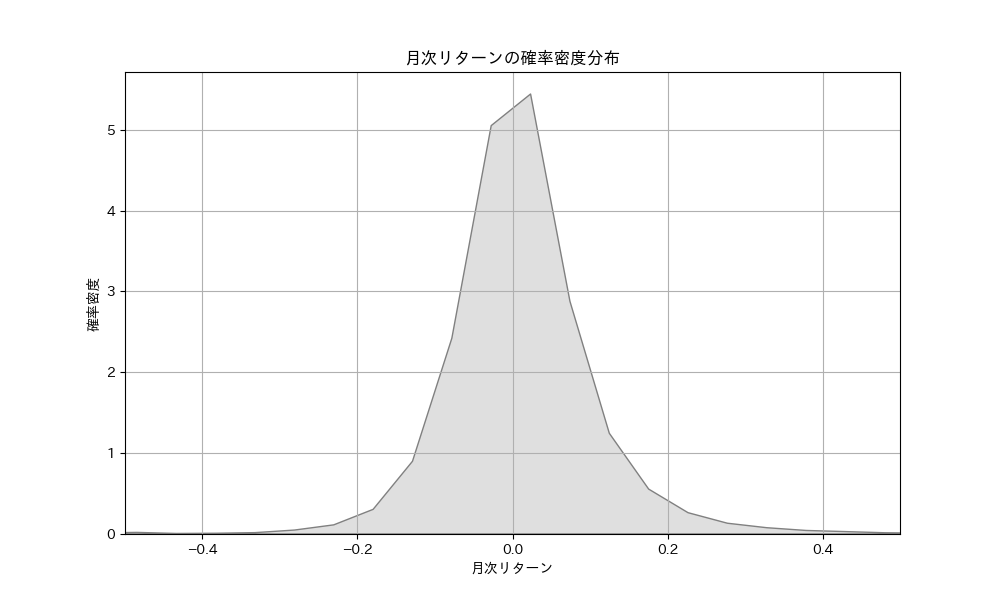
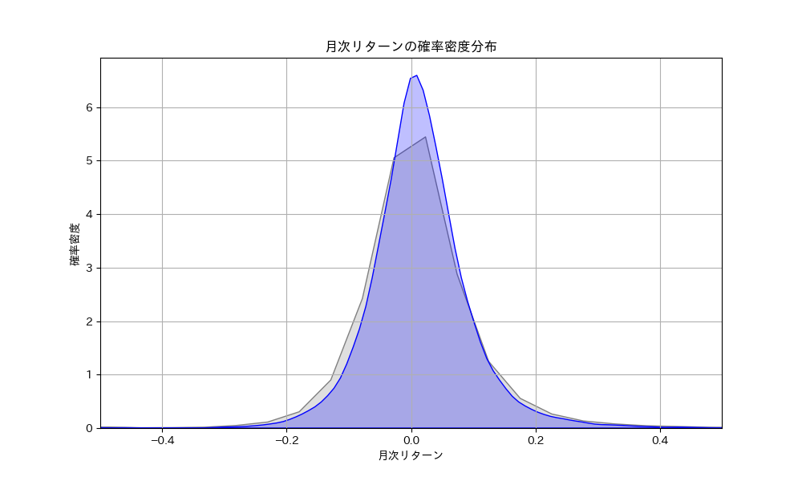
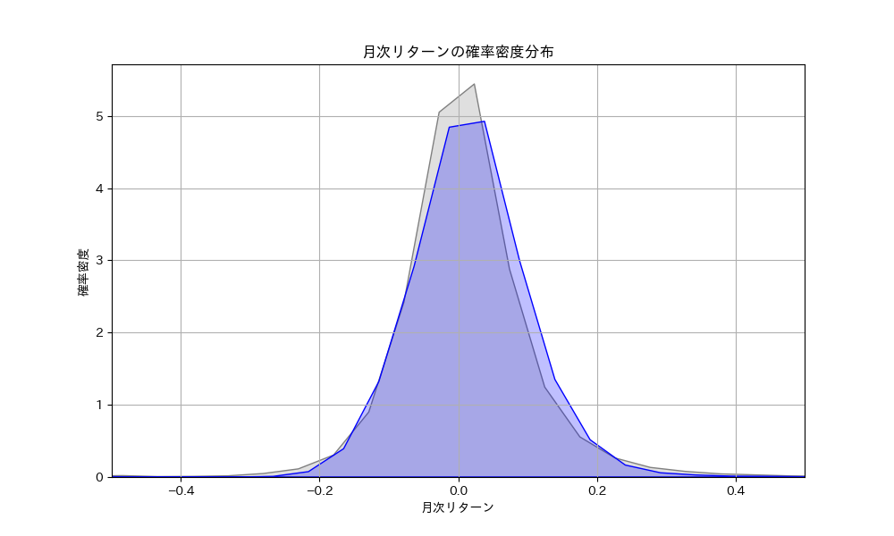
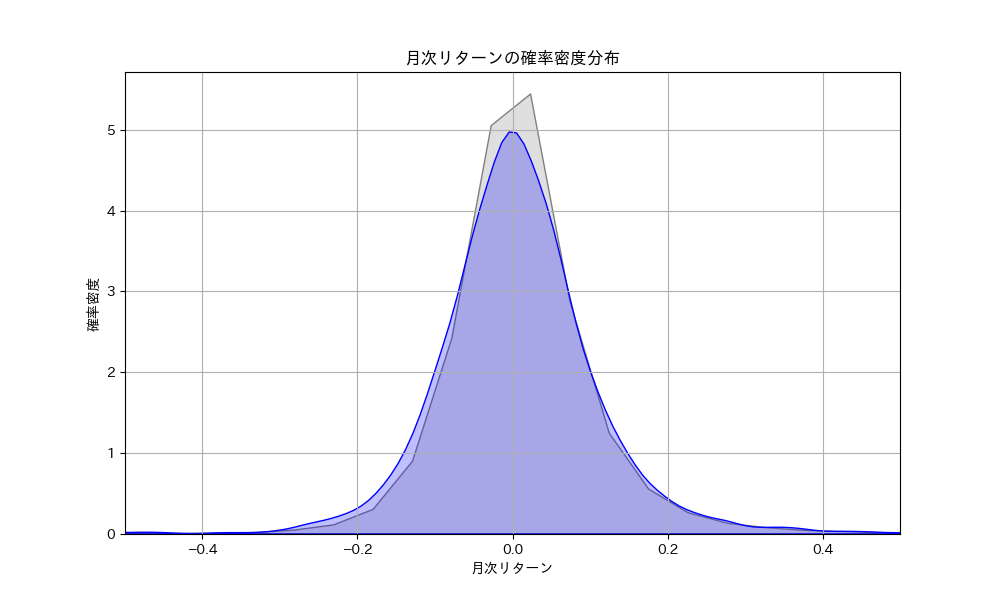
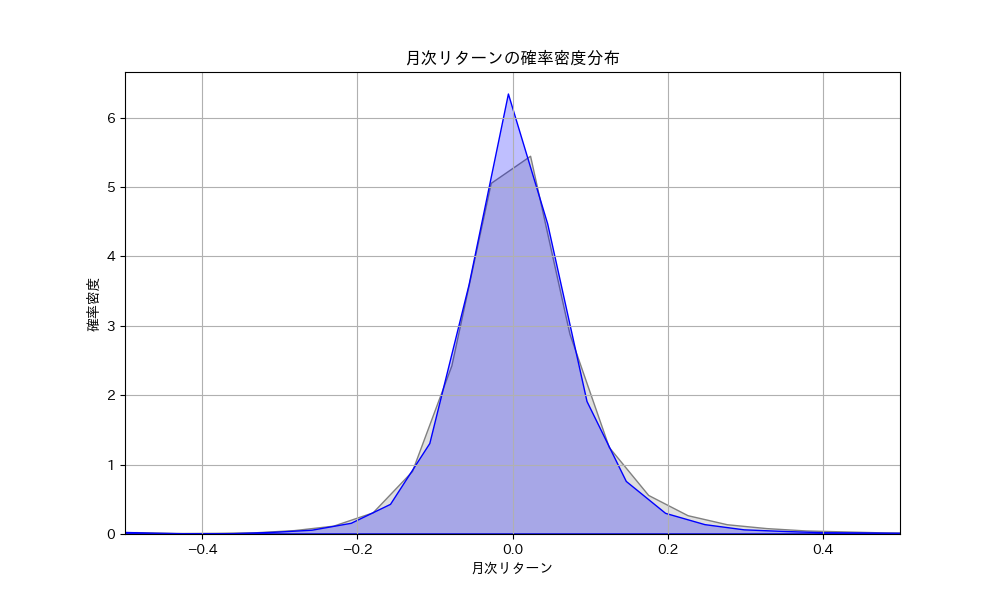
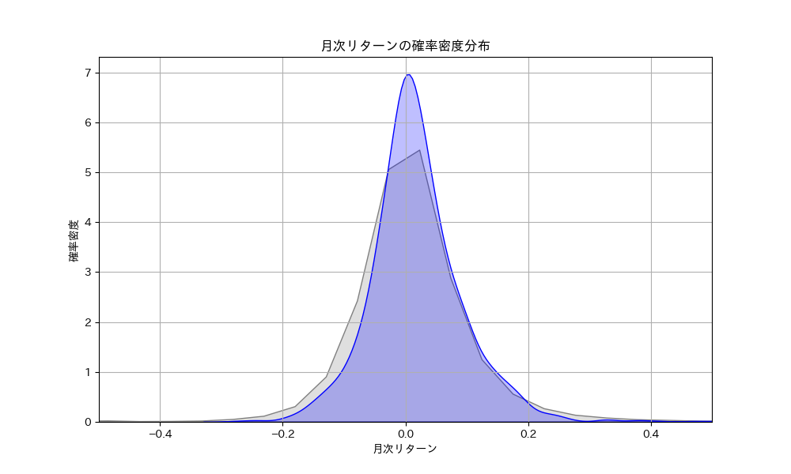

<div class="doc-header">
  <h1>だから AI 投資の夢を諦められなかった</h1>
  <div class="doc-author">すなが</div>
</div>

# だから AI 投資の夢を諦められなかった

## はじめに

みんなが同じ夢を見る。触れれば消えてしまうような泡沫の夢だ。「あーあ金が無限に増えないかなぁ」そんな思っているだけでは到底叶わない下品な夢だ。でもみんなが同じ夢を見る。だからこそ、それは人類の根源的な欲求ともいえる。私たちは億万長者になりたいのだ。そしてその欲望にとりつかれたエンジニアは同様に皆こう考えるのだ。

**AIに投資させれば無限に儲けられるのでは**

私もそう思った一人です。本記事はデータサイエンス、株式投資どちらもほとんど初心者の私がその夢を諦めるまでの２〜３週間を共有します。ただ勘違いしてほしくないのは、私は AI 投資が儲からないという主張を決してしたいわけではありません。私が諦めるまでに試した手段を本記事でお伝えしたいのです。本記事を読んで「いや…いけんじゃね」と思った方はどうぞ私の屍を超えて、AI 投資で稼いでほしいです。そしてやり方をこそっと私に教えて欲しいと思っています。こそっとね。

## おことわり

本記事では AI 投資という表現を用いていますが、不適切な表現であることは疑いようがありません。適切な表現は機械学習投資であると思っています。しかしながら、AI の部分集合として機械学習があると筆者は思っていますので、不適切ではあるが間違っていないと思っています。AI 投資といったほうがなんとなくキャッチーになる気がしたため、本記事では AI 投資と記述しています。みんなに見てもらいたい筆者のエゴです。お許しいただければ幸いです。

## 何が私を駆り立てたのか

金が欲しい。これは前述したように、全人類が抱く欲望です。例にもれず私も思ったわけです。なんか寝てるだけで金稼げねぇかな…そう思ったわけです。俗物です。卑俗です。きっと親愛なる読者諸賢もそうであることを心の底から思っています。

そんな折に、日課の記事探索をしているとこんな記事[^uki-url]が目に入ってきました。


[^uki-url]: https://note.com/uki_profit/n/nc22e324b26ad

UKI さんのこの記事です。これを読んだ時に、 **これはいける…** そう思ったわけです。こちらの記事を読んでいただければ分かると思いますが、私には説得力が大層あるように感じました。私のようなアホの子に「やってみようかな…」と思わせるには十分な説得力でした。

というかやってみようかな…どころではなく、やるか。ぐらいの勢いだったと記憶しています。そして私はシステムトレードについての情報収集を始めました。その中でさらに私をやる気にさせる事実が発覚しました。**それは公開されている情報が多くないことです。**

それではやる気にはならないのではないか。情報が少ないのは困ることでしかないのでは。そう感じる方もいることでしょう。しかし間違いではなく、それがために私はやる気になったのです。例を考えてみましょう。稼げる投資 AI を作れたとして、あなたはそれを公表するかを考えてください。するわけがありません。その情報は独り占めすればいいわけです。もちろん私も公開しないです。仲がいい人ならともかく、見ず知らずの人に簡単にお金を稼ぐ方法なんか教えるわけがありません。**つまり多くの人が実際に稼いでいるから、情報が出回らない。**そう私は判断しました。もちろん多くの人が失敗したから、情報が出回らないという可能性もありますが、考えないこととしました。面白くないので。夢がないので。この世は夢に満ちています。そう宇宙に充満するエーテルのように。そう信じることにしましょう。

そうしてこうして私はアマゾンの奥地のような開けていない場所に身ひとつで何も持たずに迷い込んでいくことになったのです。

## やったこと

気分は海賊王になる夢をたずさえて、小さい船に乗って大海原に旅立った海賊と同じです。Python はできますがデータサイエンスは昔ちょっとかじったくらいです。株は投資信託とかはやってますが、個別株の戦略とか何も存じ上げていません。

あるのは夢と根拠のない自信だけです。

そんな私は情報を集め始めました。彼を知り、己を知らば、百戦危うからずと昔々孫氏が言っています。参考にした UKI さん…ここでは先生と呼ばせていただきます。
まずは先生の記事を読み漁りました。

読んで読んで読みまくりました。とりあえずあらかた読みました。読めば読むほど、「これはイケそうだな…」という気持ちになっていきました。

まず先生の記事からきちんと統計を理解している見識の深さが見て取れました。そして先生は具体的なやり方を一切教えてくれません。「こういう方向でやると私はうまくいったよ。あとは自分で考えて、試行錯誤してね」それが先生のスタンスなのです。もちろんうまくいっていないから、具体的にいわないという可能性ももちろんあります。だがこの場合記事を作成するメリットが先生にありません。お金を稼げていないのであれば、記事を有料にすると考えられます。具体を語ると、自分にも影響が出るので、具体は語らないが、「これでうまくいったから共有するで」というスタンスな気がしてならないのです。そのことが私の中の AI 投資は可能性なのではという疑惑をどんどん深めていくことになります。本当に可能なら詳しく教えないはずです。

## じゃあ実際に作ってみっか

色々読み漁り、本を幾冊か買い、知識自体は手に入れました。そこで実際に作ってみることにしました。まずはいったんプロトタイプを作ることが私のマイフェイバリット。ミニマムなものを作成して、そこから肉付けをしていくのが私の好みです。機械学習におけるミニマムは何だろうと考えたとき、私は説明変数、目的変数だと考えました。

目的変数とは推論したい対象で、説明変数は推論したい対象の要因となりうる変数のことと私は思っています。前述したように私はそこまで詳しいわけではないので、正しくない可能性があります。正確なことを知りたい場合はご自分で調べていただけると助かります。

とりあえず作るプロトタイプでは最小限の説明変数でひととおりの実装を目指すことにしました。

データは先生の記事を見習って jquants [^jquants]を使用しました。調べればすぐ出てくるので、解説もその公式ホームページに預けます。

使用したデータはミニマムに topixLarge70 と core30 にしました。おおよそ 100 程度のデータ量です。

またある日の`終値 - 始値`を目的変数とし、それ以前のデータを用いて説明変数を作成しました。

[^jquants]: https://jpx-jquants.com

### 説明変数

ミニマムにした説明変数はテクニカル指標とファンダメンタル指標をある程度混ぜたものにしました。

- PER
- PBR
- MACD
- RSI
- 配当性向

以上を説明変数としました。各々の意味の解説は割愛します。私が説明するよりも Google 先生や ChatGPT 先生のほうが正しいと思っていますし、解説した記事はインターネット大海原に散らばっています。

これらを選択した理由としては一番ノーマルそうだからです。奇をてらったものではなく、比較的ノーマルなものを入れてまず判断しようと考えました。

### 目的変数

```終値 - 始値```を目的変数としました。売るタイミング、買うタイミングまでを予測するのは難しいと先生の記事から私は感じ取り、市場の開始とともに株を買い、終了とともに株を売るというシステムにしようと考えました。俗にいう「寄り引け」という売買手法です。
そのため、```終値 - 始値```を目的変数にしました。

### 使用した回帰モデル

Lasso 回帰を使用しました。大先生が使用していたので、使用しました。本来的にはモデルの選定は適切なものを論理的に選定するべきですが、前述したように知識があまりないので、いったん素直に鵜呑みにしてみることにしました。

### 結果

```
MSE: 26801.90424094344
Coefficients: [-2.22810148e+00  1.59344383e-03  1.25574576e+00  2.35161840e+00
  7.93734793e-02 -4.41860288e+00]

```

### 考察

まずよかったこととしてはプロトタイプができたことです。最初の一歩がいつだって一番大変であることは、人類として十数年やってきた読者諸賢には釈迦に説法だと思われます。その最初の一歩ができた時点でこのプロトタイプには価値があります。これに改良を加えて、最高の投資 AI を作るので、精度等々は今後の改善点と考えました。

#### 評価指標

問題点としては MSE が指標になりづらいところです。そもそも MSE とは最小二乗誤差の略なのですが、これが今回の場合の評価指標では適切でないことが一番の問題と考えました。この値は実際の値と推測した値の二乗を加算したものですが、26801 といわれてもイマイチよくわかりません。同じデータを使用して幾ばくかの改良を加えて、比較するのであれば有用ですが、今回のケースではこの指標がいいのか悪いのかがわかりません。非常に困ります。

そこで次は実際の値と推測した値の正負の一致率を評価指標にしようと考えました。正負の一致率は今回の場合、株価が上昇するか下降するかを当てられたかということにほかなりません。もし仮にそれを 100 ％にできるのであれば、100 ％の勝率を誇ることができるわけです。そこまでは無理でも、これが 50 ％を超えることができれば、ある程度の確率で勝つことはできるわけです。

しかしながら 99 ％当てることができても、外れた１％がその利益を上回るくらいの損失であれば、勝てるモデルを作成することはできないわけです。そこである程度は実際の値と推測した値が近いことは必要になると考えました。

なので正負の一致率と MSE の両輪で評価指標とするのが適切であると考えました。

#### 特徴量の洗練

現状では特徴量が多くはないのが問題でした。先生の記事では 39 の特徴量と書いてあったので、大幅に足りないのが分かります。私が今回使用した特徴量５つ。多くの特徴量をもっと使う必要があると考えました。

#### 少なすぎるデータ量

100 程度じゃあまりにも少なすぎます。この対策としては会社数を増やすことと、別時間軸のデータを取ってくることの二軸が考えられます。

## リベンジマッチ

プロトタイプを作成したことで、対策すべきことが分かりました。あとはその対策をガンガンしていくだけです。この時点ではもう私はウキウキでした。「なんかもうできそうじゃん」そんな妄想で有頂天でした。

そう簡単にうまくいくのなら、もっとみんなやっているという事実を見ないふりをしていました。

### 前回との差分

#### データ量

今回は mid400 も入れ、加えてある特定の日の```終値 - 始値```を目的変数としていましたが、過去五年において、すべての日の終値-始値を目的変数としました。そしてそれ以前のデータで説明変数を構築しました。これにより、１銘柄当たり 1000 近いデータを作成することに成功しました。

#### 特徴量


上記の先生による jquants のコンペのコード[^uki-github]を参考にしました。このコードは決算直後の株の動きを予測するものですが、一般の状態のときでも適用可能なものもあるだろうと考え、いくつかの特徴量を流用しました。数が膨大なので、すべてを列挙することは避けますが、50 近い特徴量を使用しました。

[^uki-github]: https://github.com/UKI000/JQuants-Forum

#### 評価指標

前述した考察のように正負の一致率を導入しました。

### 結果

```
符号の一致率: 50.81％

```

### 考察

特徴量を洗練もさせていませんし、雑に作っただけではありますが、符号の一致率が 50.81 ％なのは未来がないように感じました。少し変えたりすると 45.81 ％になるなど、本当に 50 ％の間をウロチョロする感じで、未来を感じませんでした。作成したモデルは上がるか、下がるかも推測できなかったのです。

## まとめ

だから私は投資 AI の夢を諦めました。しかしながら私が諦めただけであって、投資 AI が不可能であると主張したいわけでは決してありません。ただそれ相応のデータサイエンス系の知識と株のドメイン知識が必要になるといいたいのです。一朝一夕で簡単にできるようなものではなかったということを私は主張したいのです。

私はまだ若いので、やりたいことややるべきこともまだたくさんあります。この投資 AI を作成することに全力を注ぐような時間は私にはないと考えました。そういった意味で私は投資 AI を作成することを諦めました。私の雑な皮算用ですが一年は勉強と実装期間が必要になって、きちんと収益化できるのはもっと後になりそうな感じがしました。

ただの言い訳ですが、私はやりたいことがたくさんあります。できるかどうかわからない金儲けのためにそこまでの時間をかけたくないのです。あくまでこれは私の意見です。金儲けに一年死ぬほど頑張る価値があると考えるお方はやってみるべきです。そこで得られるものは小さくないと考えます。

挑戦する方のために役に立つかわからない私の感覚を言語化します。株をミクロで見るとランダムウォークで、マクロでみると上昇というひとつの傾向が見えると思っています。私の肌感覚としてはこのマクロとミクロの境目に機械学習の入り込む余地があって、金を稼ぐ余地がありそうだなという感覚でした。またそのランダムウォークにも人間の意志が介在するので、微妙なほころびがあって、その隙をつくような手段が必要になりそうだなという印象でした。

是非私をステップにして、最高の投資 AI を作り上げて欲しいと思っています。できたときに、一ミリでも私に感謝の念があるならば、こそっとやり方を教えて欲しいと思っています。そうしてもらえば私が記事を公開したかいがあるってものです。


以上が半年前、 Qiita に投稿した記事[^qiita]の微修正バージョンです。

[^qiita]: https://qiita.com/nagasunari/items/04c379890215ee95b34c

## マイ野望の死から半年後…

ゆめみ大技林の募集がありました。「技術同人誌に寄稿とかしたことないなぁ…今月ちょっと暇だし…やってみるか…プチバズした記事の改訂版だせばいいべや…」と思って、久方ぶりに半年前書いた記事を読み返してみました。

このときの私の言いようのない落胆と、表現しようのない怒りは筆舌に尽くし難いものでした。自分の頭の足りなさにほとほと愛想がつきました。
なんだこれは…先生の記事を１ミリも理解できていない…。やってることの意味がわからない…。ただ闇雲に適当にやってダメだった…って言っているだけじゃないか…。小学生の感想でももっといいの書くぞ…と。流石にそれは言い過ぎですが、確かにその適当さと見識の浅さに怒りをとおり越して、呆れ、落胆しました。

海より深い落胆をしました。だがこうも思いました。

**半年が経って、そこそこ知識のついた今の私になら…できるのでは…**


**夢だった投資 AI を作れるのでは**

そう強く思いました。

そして、また実行することにしました。

> 本記事を読んで「いや…いけんじゃね？」と思った方はどうぞ私の屍を超えて、AI投資で稼いで欲しいと思っています。そしてやり方をこそっと私に教えて欲しいと思っています。こそっとね。

と半年前の私は言っていたが、図らずも半年後の私が「いや…いけるのでは」と思ったのは、面白いですね。他力本願極まりないこの文章が、半年後の自分に刺さるとは…他力が実は半年後の自分の力だったというのはなかなかに面白いです。事実は小説よりも奇なりなのだと実感しました。そこまで奇かどうかはさておき。

## 何がダメだったのか
まず以前の私のダメだったポイントを今の私が挙げてみます。以下２点がダメだったポイントだと思っています。

- 機械学習を使ったこと
- 誤った指標を使ったこと

### 機械学習を使ったことがダメだった
そもそも考え方がダメです。半年前の私はデータを機械学習にかけて、ひとつの銘柄の株が上がるか下がるかを予測しようとしていましたが、この考えがそもそも間違いでした。
間違いと断ずるのは言い過ぎですが、少なくともよくない考えだったなと思っています。

先生の記事を読むとただ「スクリーニングして機械的に儲かる確率が高いものを買うと儲かりそうだよ」という話しかしていないのです。他の記事を漁ると機械学習にかける記事も出てきますが、本質としてはデータを分析して、儲かる確率の高いものを機械的に買えば儲かりそうだよという話が先生の話の本質だと思っています。
機械学習という難しいものを使うのではなく、ただ単純に統計を用いて儲かる確率が高いものを買うべきなのです。その統計を使う上で機械学習が解決法として適切ならば使うべきですが、そうでないならば、機械学習を使う必要がありません。

条件を設定して、それでスクリーニングしたら儲かるのか。儲からないのか。という話だけでよかったはずです。それが早とちりとアホ丸出しで、機械学習に飛びついて、できなかったと結論を出したのです。愚かなことこの上ありません。

ただ実践したというところだけは褒めてやってもよいです。実践するというのは多大な労力が必要となります。それを惜しまずに実行したというのは褒められる行いです。よくやった半年前の俺。

### 誤った指標を使ったことがダメだった
株をミクロで見たらランダムウォークであると、自分で言っています。したがって、正負の一致率を測って平均とって 50 数％という数値が出たという事実に大した意味がありません。もちろん正負の一致率を 99 ％にできるなら話は別なように思われますが、その脅威の一致率でさえも「**結局それでリターンはプラスになるのか**」という疑問に答えられません。我々がしたいのはお金を稼ぐことです。であるのならば、指標はどれくらいお金を稼げそうかであるべきであり、決して正負の一致率ではありません。誤った指標を使っていたといえます。

以上２点が今の私が思った半年前の自分のダメだったポイントです。このダメだったポイントを改善するのが、これからしたいことです。それでは半年前の敗北から半年経って、多少はまともになったはずの私の戦略を語っていくことにしましょう。

## 今回の戦略
今回はもっとレベルの低いことをしていこうと思っています。アホに機械学習など過ぎたる道具でしかありません。強者には強者の戦略があるように、弱者には弱者の戦略があるのです。つまりバカにはバカの戦略があります。

やることは比較するだけです。先生の記事のとおりに、**PBR などの指標でスクリーニングした企業群と何もしないでランダムに買った企業群とでどちらのほうが、儲かりやすいかの確率分布を比べていく。**たったそれだけです。

今回は確率分布を使用していきます。確率分布わからないよーという方が結構いると思っていますが、私もよくわかっていません。なんとなくわかったふりをして使用しているので解説できません。
ネット上にたくさん記事がありますし、ChatGPT やらの AI に聞くのがよっぽどよいです。そちらをお勧めします。

それすらめんどくさいという方のために、誤解を恐れない簡単な解説をします。

**ある結果がどれくらいの可能性で起こるのかをグラフ化したもの**

これがざっくりとした説明です。これ以上の説明は上記の理由から差し控えます。ないよりはマシくらいな説明ですが許して欲しいです。

この確率分布を用いて、どの指標がもっとも儲かりやすいのか、どの指標を組み合わせればもっとも稼ぐ確率が高くなるのか。この二点をこれから検証していきます。

「確率分布の理解が曖昧ならば、この記事の正しさが薄れるのではないか」という読者諸賢のその指摘はびっくりするくらい正しいです。おっしゃるとおりです。何も返す言葉はありません。ただ言い訳が許されるのであれば、私が自分で使う分には私は確率分布を理解しているつもりです。それでお許しください。

## どの指標がもっとも儲かりやすいのか

まずはどの指標がもっとも儲かりやすいかを確認していきます。そのためにまず用意するべきなのは、データとデータを解析する Python コードです。

使用したデータセットを確認します。以前と同じく jquants のデータセットを使用します。データの期間は 2020/3 ~ 2025/05 までで、銘柄は難しいことを考えず東証プライム上場企業のみにしています。データの期間については本来的にはもっと長い期間を取るべきですが、契約したプランの関係上過去５年までのデータしか取れないので致し方なくこの期間にしています。

コード[^sunaga-github]は一応公開しておきますが、誰かに見せるためではなく自分用に書いたので、大変汚いです。読む場合は覚悟して読んでほしいところです。


[^sunaga-github]: https://github.com/atuya0726/screening_stock

検証までの流れは次のようになります。

1. データセットを取得
2. データセットから一ヶ月の株価上昇値を取得
3. PBR などの指標でスクリーニングした企業群と何もしないでランダムに買った企業群で一ヶ月の株価上昇値の確率分布を比較する
3. どの指標がもっとも儲かりやすいのか、どの指標を組み合わせればもっとも稼ぐ確率が高くなるのかを検証する

今回は月次リターンを考えています。日次リターンと違いファンダメンタル指標と呼ばれる指標の恩恵を強く受けられそうだと考え、スクリーニングによるリターンの変動がよくみられそうだと思ったため月次リターンを採用しました。年次リターンを採用しなかった理由としては５年では、データが少なくなると考えたためです。

そして半年前と同様に月の始まりに購入し、月の終わりに売却するという売買戦略にしています。

特に解説するようなこともないので、結果だけ載せておきます。まずは全銘柄の平均、標準偏差を記載します。

| | 平均 | 標準偏差 |
|------|------|----------|
| 全銘柄 | 0.0095 | 0.1175 |



見方や考え方を説明します。全銘柄の平均が全銘柄を購入した時の月次の平均リターンと考えていただいて構いません。今回は一ヶ月の株価上昇値を考えたので、この場合だと全銘柄を全部一気に買った場合、月次の平均リターンは 0.95 ％ということを指しています。正規分布に基づいていそうなので、100 万円預けたら、100.95 万円になる確率がもっとも高いということです。

標準偏差はリスクだと思ってもらって構いません。正規分布に従う場合、`平均値±標準偏差`の間に値の収まる確率が 68 ％だといわれています。つまり月次リターンが 12.7 ％〜 -11.65 ％の間になる確率が 68 ％ということになります。標準偏差が大きくなれば大きくなるほど、この揺れ幅が大きくなります。揺れ幅が大きいということは、リスクが大きくなるということです。上振れれば、リターンも大きくなるので、ボラティリティが高いというのが正しそうですが、簡単にリスクとしておきます。金を稼ぎたい私を含めた多くの人類はおそらく安定的にお金を増やしたいので、標準偏差は小さいほうがよいと考えられます。

つまり平均が大きくなり、標準偏差が小さくなっていると嬉しいのです。そしてそうなるような銘柄を選択できるスクリーニングが優秀です。本記事では省きましたが、本来は標準偏差を揃えて平均を比較するべきです。同じだけのリスクをとった場合にどれだけリターンが返ってくるかという値にしたほうが比較しやすいのでよいはずです。ただ簡単のために、本記事では省くことにしました。気になる方はぜひご自分でやってみてください。

次に示す指標でスクリニーングをしました。

- 売上高成長率: 直近４期の平均成長率がすべてプラスの銘柄を選択
- 利益成長率: 直近４期のの利益成長率がすべてプラスの銘柄を選択
- PBR: PBR が低い銘柄を並べて上位 10 ％の銘柄を選択した。
- ROE: ROE が 10 ％以上の銘柄を選択
- MACD: MACD がシグナル線を上回っている状態 ＆ ゴールデンクロス付近
- 移動平均: ５日の移動平均線が 20 日の移動平均線を上回っていて銘柄のうち傾きが上位 10 ％の銘柄を選択した。

| 指標 | 平均 | 標準偏差 |
|:------:|:------:|:--------:|
| 全銘柄 | 0.0095 | 0.1175 |
|------|------|------|
| 売上高成長率 | 0.0138 | 0.0850 |
| 利益成長率 | 0.0125 | 0.0867 |
| PBR | 0.0184 | 0.1792 |
| ROE | 0.0040 | 0.1101 |
| MACD | 0.0055 | 0.1172 |
| 移動平均 | 0.0055 | 0.1248 |

### 売上高成長率



### 利益成長率


### PBR



### ROE



### MACD



### 移動平均


他にもいろいろやりましたが、紙幅を取りすぎるのが申し訳ないので、個人的に事前に有用だと思っていた指標をピックアップしてみました。

簡単にパッとわかりやすいのは、売上高成長率、利益成長率、PBR です。平均が改善したので、これらの指標でスクリーニングした銘柄群は儲かりやすそうということが正しそうです。売上高成長率と利益成長率は標準偏差も小さくなっているので優秀な指標といえます。PBR はもっとも平均を改善しましたが、その分標準偏差も大きくなっています。ハイリスクハイリターンであることが分かります。

ROE は全銘柄を買った場合と比べると、成績が悪くなっています。これは個人的には驚きの事実だったので、もしかすると私の算出法が間違っている可能性があります。一応確認はしましたが。
この結果があっているとするのであれば、ROE は機械的に株を買う際には考慮に入れる必要はなさそうです。
他のファンダメンタル指標については、全銘柄を買った場合の成績を超えるものはありませんでした。かろうじて標準偏差が改善しているものがいくつかありましたが、平均の減少を補えるほどの改善ではなかったで無視してよいと考えました。

そしてテクニカル指標ですが、これ以外にも多くの指標を試したところ、そのどれもがランダムに買った場合と比べると成績が悪くなっていました。これもまた驚きの事実です。巷に流布するテクニカル指標は意味がないというのは、こういった事実からいえることなのだと考えられます。もちろん私の算出方法が間違っている可能性も十分にあります。

ただ忘れてならないのは**プライムの銘柄において一ヶ月の株価上昇値の確率分布を比較している**という前提です。期間がもっと短ければテクニカル指標が猛威を振るう可能性がありますし、もっと長ければ ROE が他の追随を許さぬほどの成績を出す可能性だってあります。
**この条件下においてのみ** 、このような結果が出たというところを忘れてはいけません。テクニカル指標がダメとはこの結果からはいえませんし、ROE がダメともいえませんし、PBR が手放しでいいともいえません。

重ね重ね言いますが、私が導出方法等を間違えている可能性も十分にあります。

結論として、プライムの銘柄において一ヶ月の株価上昇値を改善するための指標は、売上高成長率、利益成長率、PBR であると考えられます。

## どの指標を組み合わせればもっとも稼ぐ確率が高くなるのか

前節において、どの指標がもっとも儲かりやすいかを確認しました。
それでは、どの指標を組み合わせればもっとも稼ぐ確率が高くなるのかを確認していきます。

そこで問題になるのは、どのように指標を組み合わせれば、もっとも成績がよくなるのかという問題です。

わかりやすいのは個別でもっとも儲かりやすい指標を選択して、それを組み合わせるという方法です。
つまり売上高成長率、利益成長率、PBR の指標すべてがいいものを選ぶという方法です。
メリットとしてはおそらくもっとも効果が高くなるだろうということですが、デメリットとしてすべての条件を満たす銘柄がないという可能性がありえます。
たとえば売上高成長率、利益成長率、PBR の指標それぞれで上位５％の銘柄を選択したとしても、その銘柄が重複していない可能性があり、すべての指標において上位５％の銘柄はない可能性が十分にあります。
試しに売上高成長率と利益成長率の指標を組み合わせてみることにしましょう。単純にどちらの上位５％にもなっている銘柄を選択します。

| 指標 | 平均 | 標準偏差 |
|:------:|:------:|:--------:|
| 全銘柄 | 0.0095 | 0.1175 |
| 組み合わせた銘柄 | 0.0135 | 0.0856 |
|------|------|------|
| 売上高成長率 | 0.0138 | 0.0850 |
| 利益成長率 | 0.0125 | 0.0867 |


大幅な改善は見られません。それもそのはずで、売上高成長率と利益成長率は似た概念なので重複を取ってもあまり効果がないのだと考えられます。

それでは売上高成長率と PBR の指標を組み合わせてみます。売上高は４期連続プラス、PBR は上位 10 ％の銘柄を選択してみます。


| 指標 | 平均 | 標準偏差 |
|:------:|:------:|:--------:|
| 全銘柄 | 0.0095 | 0.1175 |
| 組み合わせた銘柄 | 0.0181 | 0.0765 |
|------|------|------|
| 売上高成長率 | 0.0138 | 0.0850 |
| PBR | 0.0184 | 0.1792 |



これは大幅な改善が見られました。現状で月次リターンは平均 1.81 ％で、年次リターンは平均 23.88 ％となります。これだけでも驚異的な数字です。そして標準偏差が PBR と売上高成長率のどちらよりも小さくなっている事実は非常に興味深い点です。
なにか間違えているような気がしてならないですが、私の書いたコードが間違っていなかったらこれが正しい数字です。

驚異的な数字ではありますが、見過ごせない問題もあります。それは、該当する銘柄数が非常に限られている点です。実際、５年間のうち 31 ヶ月は条件を満たす銘柄がひとつもなく、購入できない月が多く存在しました。
これでは、投資期間のうち約３年間は資金を寝かせることになり、想定したリターンを安定的に得ることが難しくなります。
複利の効果を十分に享受するためには、可能な限り安定して資金を投下し続けることが重要であり、半分以上の月で投資できないというのは、運用面で大きな欠点といえます。
そういった点においてきつい条件で絞りすぎてしまっているのも運用を考えると問題と考えられます。運用的にも問題があるが、精度の問題も無視はできません。該当銘柄が少なすぎるということは偏りすぎたデータで確率分布を作った可能性があるということです。その確率分布が果たして正しいのかどうかの判断は難しいです。ひょっとすると何か確認方法がある可能性はありますが、私の脳みその中にはまだありません。

つまるところ平均値、標準偏差を改善させつつも、毎月購入できる銘柄を出す方法を考えていく必要がありそうです。

ではどうすればよいでしょうか。サッと思いつくのは、指標を絞りすぎないようにするということです。
今売上高、PBR それぞれ上位５％の銘柄を選択しています。これを上位 15 ％にしてみるなどが考えられます。ただこれは問題の本質的解決にはなりません。

どうやらアプローチを変える必要がありそうです。
たとえば売上高成長率、PBR のランキングをつけて、そのランキングを加算して新たなランキングを作って、数値が小さい順の上位５％を取得してみる方法がありそうです。
また単純に加算するよりも指標に重みをつけるという考えもあります。先ほどのデータを見る限り、PBR のほうが売上高成長率よりもより平均値の向上に寄与していることが分かります。
そのため、PBR の重みを大きくして、売上高成長率の重みを小さくしてみるというのもひとつの手なように感じられます。
概してアプローチとしてはランキングをつけて、そのランキングを処理して上位５％を取得するというのはひとつ改善策として考えられそうです。

また機械学習という文明の力を使うこともここに至ってやっと検討できます。機械学習の強みは「PER が低く、出来高が増加し、ゴールデンクロスが出ていて…」など複数の複雑な条件を組み合わせて最適化できるところにもあります。今の状態にぴったりなのです。

ですが、これ以上は深掘りしません。なぜなら、もうこれ以上公開したくないからです。

今私が手にしようとしているのは、金のなる木です。失礼、言いすぎました。金のなる可能性が高そうな木です。

これを公開する必要があるとは思えません。先述しましたが、本当に儲かる可能性があるのなら自分だけで独り占めしたいのです。私も例に漏れません。

強欲すぎて大変申し訳ないですが、読者諸賢に公開するくらいなら私だけで独り占めしたいと思っています。もうだいぶ公開してしまった気がしますが、ゆめみ大技林をお手にとっていただいた見返りみたいなものです。

これ以上深掘りしない理由は強欲以外にももうひとつあります。それは読者の皆様にも実践してほしいからです。もちろんこの記事を読み思考停止で「へぇそうなんだ」となるだけでも私としては嬉しいですが、「本当だろうか。実際にやってみよう」と思って実践してほしいです。そこから得るものは多いはずです。少なくとも私はこの実験をするために確率分布のお勉強を高校か大学ぶりにして、統計の面白さを知りました。近く統計検定をとってみようかなと思って、公式問題集を購入したくらいには統計への興味が増えました。余計なお世話ですが刺激的な人生を送るために、世の中の多くの人間が多くの事柄に興味を持って生きてほしいなと勝手に思っているので、こういった体裁をとりました。

あとこれはナイショの話ですが、これ以上書くのが面倒だったというのも偽らざる本音です。この後を書くのであれば、実際に作って運用するまでをしないといけません。それをするには運用するための資金も必要になるますし、何より時間がかかります。少ない資産や時間をそこに投じるくらいなら、機械に任せず、自分で運用したほうがまだマシだろうという気持ちがありました。めんどくさいなと思ったのもまた嘘ではないことを正直に記しておきます。

読者諸賢にこの記事の使い道は任せます。よりよい指標を探してもよいですし、改善してもよいですし、また違うアプローチを試してもよいです。願わくば何かしらのアクションを起こして、何かしらへの興味が育まれれば私は泣いて喜びます。

私がこの記事で示したのは、**AI 投資は儲かる可能性がありそう**。

という事実です。もちろん今は机上の空論で、理論的に儲かるとなっていますが、運用したら儲からないみたいなことは考えられます。だが、理論上は儲かるように思われるという事実をとりあえず本記事では示したつもりです。

「AI 投資はもしかしたら儲かるの可能性があるのかも」という先生の記事から持った疑念を今、自分の手で動かしてみて裏付け込みで、確度の高そうな「AI 投資は儲かりそうだ」という示唆に昇華できました。示した事実は先生の記事とほとんど変わっていませんが、実際に手を動かした私はより確かな強さでそう信じることができています。

また学んだこと実践したことをアウトプットして残しておくと、誰かの役に立つことに加えて未来の自分の好奇心を刺激することもあるという実例をお見せできたことも、ひとつこの記事の価値です。

読んでくれてありがとうございます。重ねますがこの示唆が私から読者諸賢へのプレゼントです。

**AI 投資はどうやら儲かるらしい**

もっとも簡単ではなさそうなことだけは申し添えておきます。
