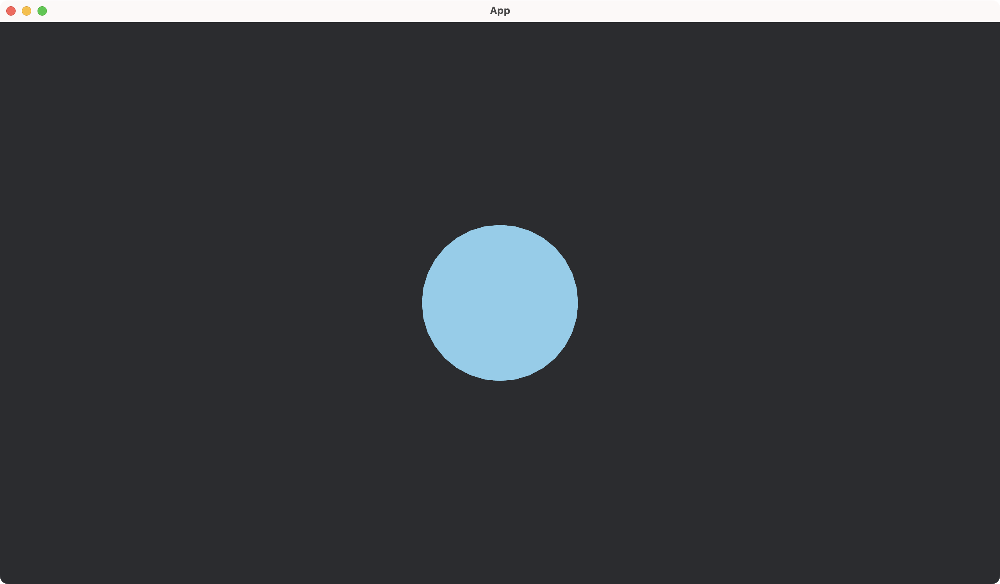
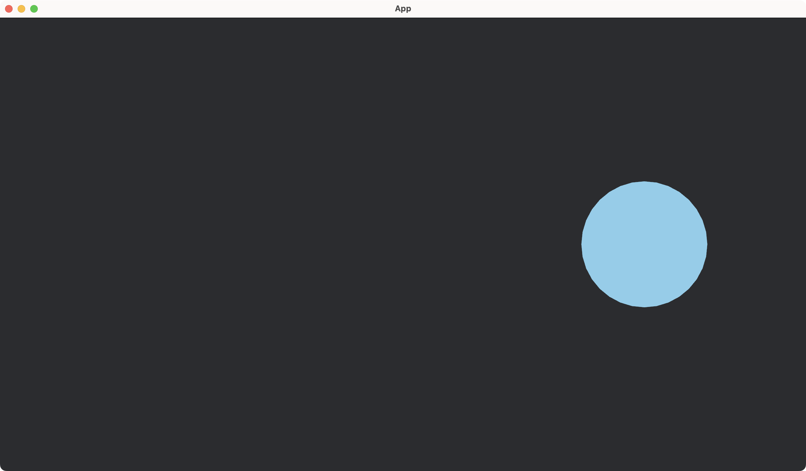

<div class="doc-header">
  <h1>Rust Bevy によるクリエイティブコーディング</h1>
  <div class="doc-author">宇佐見公輔</div>
</div>

# Rust Bevy によるクリエイティブコーディング

クリエイティブコーディングとは、何らかの表現を創造することを目的とするプログラミングのことです。通常のプログラミングは何らかの機能を実現することを目的としますので、それとは異なっています。愛好家たちによって、ビジュアルアートやサウンドアートなどの作品が制作されています。

以前のゆめみ大技林で、Nannou（ナンヌー）[^nannou]フレームワークを利用したクリエイティブコーディングについて書きました。

- Rust Nannou でクリエイティブコーディング（『ゆめみ大技林 '23（2）』に掲載）
- Rust Nannou 作図事例（『ゆめみ大技林 '24』に掲載）

今回は、フレームワークとして Bevy（ベヴィー）[^bevy]を使う方法を紹介します。Bevy はゲーム制作のためのフレームワーク（ゲームエンジン）です。

[^nannou]: Nannou 公式サイト https://nannou.cc/

[^bevy]: Bevy 公式サイト https://bevyengine.org/

## クリエイティブコーディングの方法

クリエイティブコーディングを行うときには、制作を補助してくれるフレームワークを利用することが多いです。

クリエイティブコーディング専用のフレームワークが存在します。有名なものとして、Processing、p5.js、openFrameworks があります。一方で、専用のフレームワークの代わりにゲームエンジンを利用することもあります。Unity、Unreal Engine がよく使われています。

専用フレームワークは、クリエイティブコーディングに特化しているため、始めるハードルが低くなっています。情報が多くサンプルも豊富です。ゲームエンジンは、さまざまなゲームを制作するための汎用的なフレームワークであるため、単にクリエイティブコーディングをしたいだけであっても必要な知識が多くなり、始めるハードルはやや高くなります。しかし、汎用的であるぶん実現できることが多く、さまざまな表現が可能になります。

## Bevy と Nannou

プログラミングが好きな人ならば、自分が好きな言語を使いたいでしょう。ここでは、Rust 言語でクリエイティブコーディングをすることを考えます。

冒頭でも紹介しましたが、Rust で使えるクリエイティブコーディング専用のフレームワークとして Nannou（ナンヌー）があります。これは始めるハードルが低く、すぐにビジュアルアートを制作できます。

一方、Rust で使えるゲームエンジンのひとつに Bevy（ベヴィー）があります。オープンソースで開発されており、無償で自由に利用できます。新しめのゲームエンジンですが、開発が活発でコミュニティによる情報交換も盛んです。シンプルで高速、モジュラー指向、拡張性が高い、といった特徴が人気の理由でしょう。クリエイティブコーディングにも向いています。

実のところ、Nannou を Bevy のプラグインとして再設計・再開発する活動が進められています。Nannou の使いやすさと、Bevy の高い拡張性との統合を目指しています。ただ、こちらはまだ開発中であり、正式にはリリースされていません。今後に期待したいところです。

現時点では、Rust でクリエイティブコーディングをしたいなら、次の二択になるでしょう。

- Nannou を使う（Bevy プラグインではなく従来のもの）
- Bevy を使う

この記事では、クリエイティブコーディングに Bevy を使う方法を見ていきます。

## Bevy のセットアップ

まずは Bevy を導入してみましょう。

Rust 言語の開発環境はすでに整っていることを前提とします。開発環境の構築は Rust 公式サイト[^rust]を参照してください。

[^rust]: Rust 公式サイト https://www.rust-lang.org/

`cargo` コマンドでプロジェクトを新規作成します。

```shell
cargo new my-bevy-project
```

作成されたプロジェクトのディレクトリに移動して、Bevy をプロジェクトに追加します。`cargo add` コマンドを使うのが簡単です。

```shell
cargo add bevy@0.16
```

これによって、`Cargo.toml` の `dependencies` に `bevy` が追加されます。なお、`cargo add` コマンドの代わりに手動で `Cargo.toml` を編集しても構いません。

この記事では執筆時点での最新バージョンである Bevy 0.16 を扱います。現状の Bevy のステータスとして、バージョンアップのときに API が変更されるなどの大きな更新がよくあります。バージョンの差異には注意してください。

プロジェクト新規作成の直後の `src/main.rs` は次のようになっています。

```rust
fn main() {
    println!("Hello, world!");
}
```

これを次のように編集します。

```rust
use bevy::prelude::*;

fn main() {
    App::new().add_systems(Update, hello).run();
}

fn hello() {
    println!("Hello, Bevy!");
}
```

`main` 関数のなかにあった `println!` を `hello` 関数に移動しています。ついでに、メッセージも少し変えています。`main` 関数の中身は後で説明しますが、この処理によって `hello` 関数が呼ばれます。

`cargo run` でプログラムを実行すると、コンソールに `Hello, Bevy!` が出力されます。

## ECS パターン

Bevy のアプリは、ECS（エンティティ・コンポーネント・システム）パターンを採用しています。ECS パターンは、ゲーム開発やシミュレーションで広く使われる、データ指向の設計パターンです。プログラムを、エンティティ、コンポーネント、システム、の 3 つの要素に分割して考えます。

エンティティは、ゲーム世界のなかの「物」をあらわす一意の識別子です。たとえばブロック崩しゲームだと、ボール、パドル、壁、それぞれのブロック、などがエンティティであらわせます。エンティティそのものには機能はなく、コンポーネントを付与することでエンティティが意味をもちます。

コンポーネントは、エンティティに付与する属性や状態です。たとえば、破壊できるブロックの属性をあらわす `Brick` コンポーネントをエンティティに付与することで、そのエンティティがブロックとしての意味をもつようになります。また、パドルの属性をあらわす `Paddle` コンポーネントをエンティティに付与することで、そのエンティティがパドルとしての意味をもつようになります。さらに、衝突検出のための `Collider` コンポーネントをブロックやパドルのエンティティに追加で付与することで、それらが衝突判定をおこなう物であるという意味になります。

システムは、コンポーネントに対して実行するロジックです。たとえば、パドルを移動する、衝突判定をおこなう、などがシステムになります。システムはゲームの進行時間やイベントに応じて実行されて、ゲームの動作を制御します。

従来のオブジェクト指向の考え方だと、データと振る舞いをクラスにまとめていました。ECS では、データ（コンポーネント）と振る舞い（システム）を分離しています。また、クラスの継承よりもコンポジション（合成）を重視し、柔軟で拡張性が高い設計となっています。

## Bevy における ECS パターンの実装

ECS パターンの要素のひとつであるシステムは、Bevy では通常の関数で実装します。最初の例（`Hello, Bevy!` 出力プログラム）にある `hello` 関数も、システムのひとつです。

```rust
fn hello() {
    println!("Hello, Bevy!");
}
```

システムを実行するには、アプリにシステムの関数を登録します。最初の例にある `main` 関数の説明を後回しにしていましたが、ここで説明します。

```rust
fn main() {
    App::new().add_systems(Update, hello).run();
}
```

`add_systems` で `hello` 関数をシステムとしてアプリに登録しています。`Update` スケジュールを指定しているので、毎レンダリングフレームに 1 回呼ばれます（ただし、このアプリは今のところウィンドウを持たないので、1 回だけ呼ばれて終わりです）。

`main` 関数全体としては、`App` を生成して（`new()`）、システムを登録したあと、実行を開始する（`run()`）という処理をしています。これで、最初の例の `main` 関数を説明できました。

さて、最初の例ではシステムだけで、エンティティやコンポーネントが登場していません。それらが出てくる例を次に挙げます。

```rust
use bevy::prelude::*;

fn main() {
    App::new()
        .add_systems(Startup, setup)
        .add_systems(Update, hello)
        .run();
}

#[derive(Component)]
struct Person {
    name: String,
}

fn setup(mut commands: Commands) {
    commands.spawn(Person { name: "Alice".to_string() });
    commands.spawn(Person { name: "Bob".to_string() });
}

fn hello(query: Query<&Person>) {
    for person in &query {
        println!("Hello, {}!", person.name);
    }
}
```

これを実行すると、コンソールに次が出力されます。

```console
Hello, Alice!
Hello, Bob!
```

この例では、`add_systems` でシステムをふたつ登録しています。`setup` システムは `Startup` スケジュールを指定しているので、アプリ起動時に呼ばれます。`hello` システムは先ほどと同じ `Update` スケジュールを指定しています。

ECS パターンの要素のひとつであるコンポーネントは、Bevy では `Component` トレイトを実装した構造体です。

```rust
#[derive(Component)]
struct Person {
    ...
}
```

エンティティについては、Bevy の内部で `Entity` 構造体が定義されています。`Entity` 構造体は整数値のフィールドをひとつだけ持ちます。

```rust
struct Entity(u64);
```

コードの補足をしておくと、これはフィールド名がない構造体（タプル構造体）を宣言する Rust の記法です。

この `Entity` 構造体のインスタンスが ECS パターンのエンティティです。`setup` システムのなかにある `commands.spawn` はエンティティを生成します。ここでは、`Person` コンポーネントが付与されたエンティティを生成しています。

```rust
commands.spawn(Person { ... });
```

Bevy のアプリには、ゲーム世界の物を格納して保持する `World` コンテナがあります。生成されたエンティティは自動的に `World` に格納されます。

システムはコンポーネントに対して実行するロジックだ、という説明をしていました。実際にコンポーネントを扱うには、関数のパラメータとして `Query` を受け取るようにします。

次の `hello` システムは、`Person` コンポーネントを扱います。`World` コンテナに保持されているエンティティから、`Person` コンポーネントのものを受け取ります。

```rust
fn hello(query: Query<&Person>) {
    ...
}
```

これで、Bevy で ECS パターンを使うおおまかな流れがつかめました。

## Bevy のプラグイン

Bevy にはプラグインの仕組みがあるので、それに触れておきます。

先ほどの ECS の例は、プラグインを使って次のようにできます。まず、`main.rs` ファイルとは別に `hello_plugin.rs` ファイルを作ります。そして、`main.rs` に直接書いていたコンポーネントやシステムの実装をそちらに移動します。

```rust
use bevy::prelude::*;

pub struct HelloPlugin;

impl Plugin for HelloPlugin {
    fn build(&self, app: &mut App) {
        app.add_systems(Startup, setup);
        app.add_systems(Update, hello);
    }
}

#[derive(Component)]
struct Person {
    name: String,
}

fn setup(mut commands: Commands) {
    commands.spawn(Person { name: "Alice".to_string() });
    commands.spawn(Person { name: "Bob".to_string() });
}

fn hello(query: Query<&Person>) {
    for person in &query {
        println!("Hello, {}!", person.name);
    }
}
```

プラグインの実装は、`Plugin` トレイトを実装すればよいです。そして、`main.rs` は次のようにします。

```rust
use bevy::prelude::*;
mod hello_plugin;
use hello_plugin::HelloPlugin;

fn main() {
    App::new().add_plugins(HelloPlugin).run();
}
```

プラグインを `add_plugins` 関数でアプリに追加しています。

このように、Bevy では簡単に各種の機能をモジュール分割できます。そして、Bevy のアプリはプラグインモジュールを活用して実装していきます。

## 図形の描画

Bevy の基本をざっとおさえたので、次にウィンドウを表示して図形を描画しましょう。

ゲームを作成するときによく使う機能は、`DefaultPlugins` として用意されています。このプラグインを追加するだけで、実行するとウィンドウが表示できます（何もない真っ黒なウィンドウですが）。

```rust
use bevy::prelude::*;

fn main() {
    App::new().add_plugins(DefaultPlugins).run();
}
```

次に、ウィンドウに図形を描画します。次のコードでは、中央に円をひとつ描画します。

```rust
use bevy::color::palettes::css::*;
use bevy::prelude::*;

fn main() {
    App::new()
        .add_plugins(DefaultPlugins)
        .add_systems(Startup, setup)
        .run();
}

fn setup(
    mut commands: Commands,
    mut meshes: ResMut<Assets<Mesh>>,
    mut materials: ResMut<Assets<ColorMaterial>>,
) {
    commands.spawn(Camera2d);

    let mesh = Mesh2d(meshes.add(Circle::new(100.)));
    let material = MeshMaterial2d(materials.add(Color::from(SKY_BLUE)));
    let transform = Transform::from_xyz(0., 0., 0.);
    commands.spawn((mesh, material, transform));
}
```

`cargo run` で実行すると、ウィンドウが開いて円が描画されています。



`setup` システムの中で描画処理を行っています。いくつかの要素が新たに出てきているので、確認していきます。

ゲーム世界に存在する物をウィンドウに表示するには、「カメラ」が必要です。そのため、カメラエンティティを生成します。`Camera2d` は、ゲーム世界を真上（Z 軸正方向）から見下ろす 2D 表示のカメラです。

```rust
commands.spawn(Camera2d);
```

ゲーム世界に描画対象となる物（ここでは円）を配置します。次のエンティティには、`Mesh2d` コンポーネント、`MeshMaterial2d` コンポーネント、`Transform` コンポーネントの 3 つ組が付与されています。

```rust
commands.spawn((mesh, material, transform));
```

`Mesh2d` は、2D の物の形状を定めます。ここでは半径 100 の `Circle` にしています。

```rust
let mesh = Mesh2d(meshes.add(Circle::new(100.)));
```

`MeshMaterial2d` は、2D の物の装飾を定めます。ここでは色を与えています。

```rust
let material = MeshMaterial2d(materials.add(Color::from(SKY_BLUE)));
```

`Transform` は、物の位置を定めます。ここでは XYZ 座標軸の原点に配置しています。

```rust
let transform = Transform::from_xyz(0., 0., 0.);
```

こうして、カメラと描画対象の物を生成すると、ウィンドウにカメラを通して見た物が描画されます。

## 図形のアニメーション

続いて、図形のアニメーションもやってみましょう。

```rust
use bevy::color::palettes::css::*;
use bevy::prelude::*;

fn main() {
    App::new()
        .add_plugins(DefaultPlugins)
        .add_systems(Startup, setup)
        .add_systems(Update, swing)
        .run();
}

#[derive(Component)]
struct SwingAnimation {
    speed: f32,
    amplitude: f32,
}

fn setup(
    mut commands: Commands,
    mut meshes: ResMut<Assets<Mesh>>,
    mut materials: ResMut<Assets<ColorMaterial>>,
) {
    commands.spawn(Camera2d);

    commands.spawn((
        Mesh2d(meshes.add(Circle::new(100.))),
        MeshMaterial2d(materials.add(Color::from(SKY_BLUE))),
        Transform::from_xyz(0., 0., 0.),
        SwingAnimation { speed: 2., amplitude: 400. },
    ));
}

fn swing(
    time: Res<Time>,
    mut query: Query<(&SwingAnimation, &mut Transform)>,
) {
    for (animation, mut transform) in &mut query {
        let position = (time.elapsed_secs() * animation.speed).sin();
        transform.translation.x = animation.amplitude * position;
    }
}
```

`cargo run` で実行すると、先ほどの例と同様にウィンドウが開いて円が描画されます。そして、その円がアニメーションで左右に揺れ動きます。



`setup` システムで円のエンティティを生成して、`swing` システムで円を動かしています。

円を動かすアニメーションのために、システムの `Update` スケジュールを利用します。これは毎レンダリングフレームに 1 回呼ばれるスケジュールでした。今回のアプリはウィンドウをもつため、繰り返し呼ばれます。そのタイミングで円の位置を変更すれば、カメラを通じて描画される円の位置も変わります。これが素早く繰り返されることでアニメーションになります。

円の位置を変更するには、`Transform` コンポーネントがもつ値を変更します。システムの関数が `Query` でコンポーネントを受け取るときに `mut` キーワードをつけておけば、コンポーネントがもつ値を変更できます。つまり、座標が変更でき、位置を変えられます。

```rust
fn swing(mut query: Query<&mut Transform>) {
    for mut transform in &mut query {
        transform.translation.x = ...;
    }
}
```

アニメーションのパラメータを渡すために、コンポーネント `SwingAnimation` を新たに作成しています。

```rust
#[derive(Component)]
struct SwingAnimation {
    ...
}
```

そして、アニメーションしたいエンティティに `SwingAnimation` コンポーネントを追加で付与しています。

```rust
commands.spawn((
    ...
    SwingAnimation { ... },
));
```

システムは `SwingAnimation` と `Transform` の両方のコンポーネントの `Query` にします。こうすることで、アニメーションしたいエンティティを受け取って、それの位置を変更することが可能になります。

```rust
fn swing(
    time: Res<Time>,
    mut query: Query<(&SwingAnimation, &mut Transform)>,
)
```

なお、`Res` はリソースを参照しています。リソースとはゲーム世界でグローバルに存在するものであり、`World` コンテナに保持されています。今回は `Time` リソースを使って、ゲーム世界が始まってからの経過時間を取得しています。

補足しておくと、実は、図形描画で使っていた `meshes` や `materials` の `ResMut` もリソースを参照していました。利用する形状や装飾をリソースとして登録しておくことで、効率的な管理と再利用ができています。

こうして、Bevy の ECS パターンの枠組みを活用して、図形のアニメーションが実現できました。

## さらなる情報

この記事では Bevy の基本を述べ、さらに図形を描画したりアニメーションしたりする方法を述べました。ここまでを把握しておけば、各種のドキュメントやサンプルが自力で読めるでしょう。そこで、このあとの情報源を紹介しておきます。

情報源として、まずは Bevy の公式ページを見るとよいでしょう。ここで多くのドキュメントやサンプルをみつけることができます。

```url
https://bevyengine.org/
```

実際、Examples には多くの例が紹介されています。図形の描画やアニメーションについては、2D Rendering のサンプルが参考になります。今回紹介した内容は Mesh2d による描画でした。それ以外にも、Sprite による描画もよく使われます。Examples の Math、3D Rendering、Animation などもクリエイティブコーディングの参考になりそうです。この記事を読んで Bevy に興味が出てきたら、それらのサンプルやドキュメントも見てみるとよいでしょう。

また、ネット上でも Bevy について多くの情報をみつけることができます。ぜひいろいろ探してみてください。
