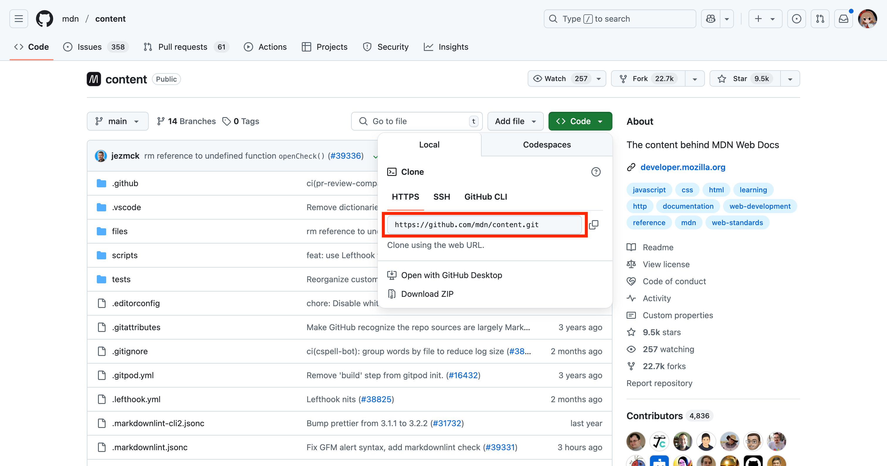
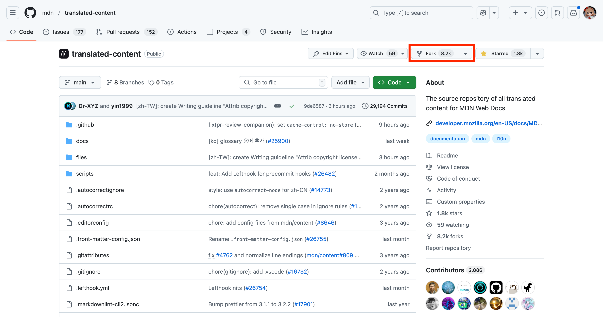
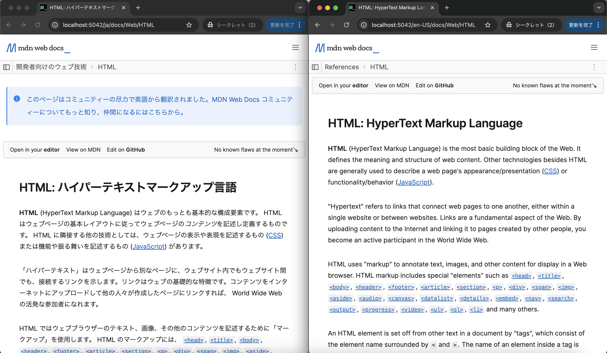
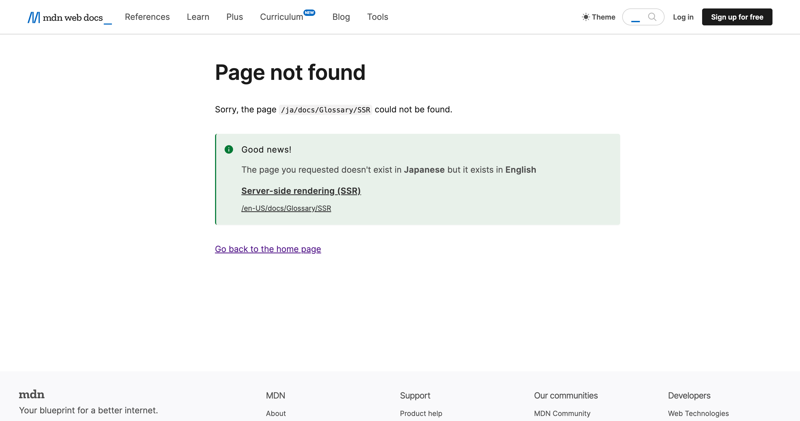
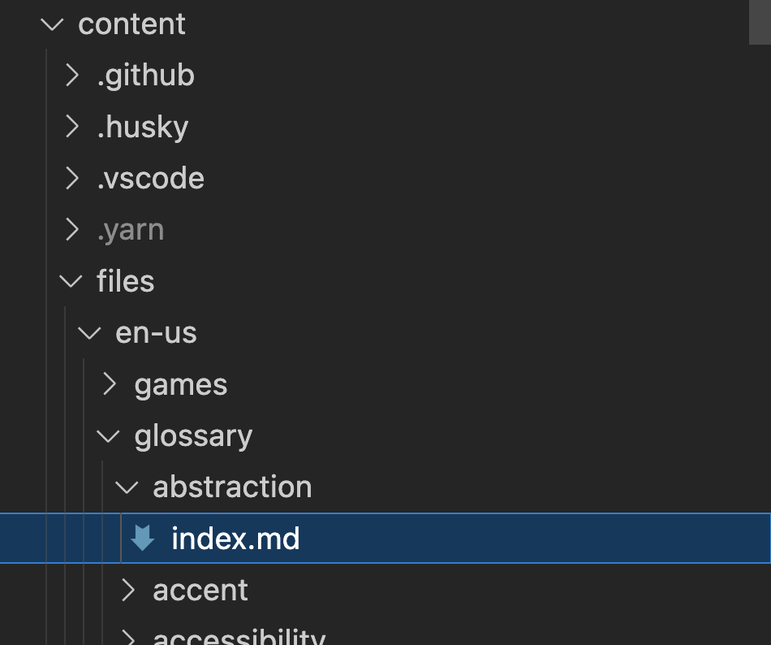
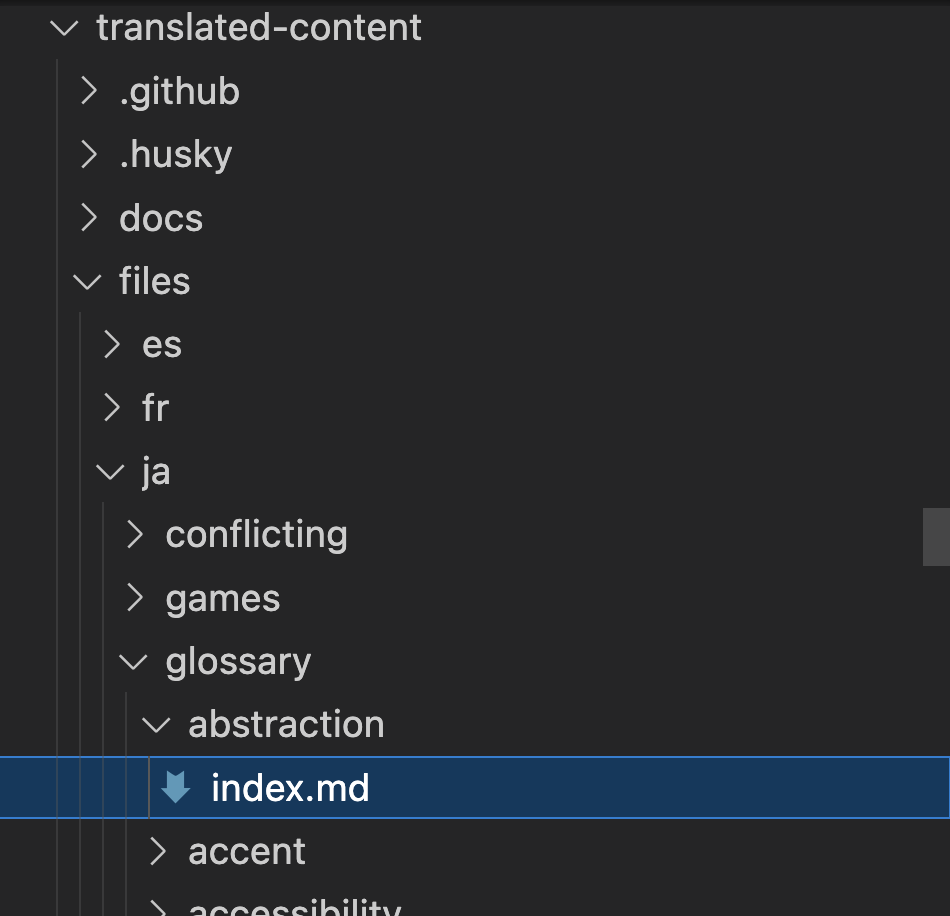
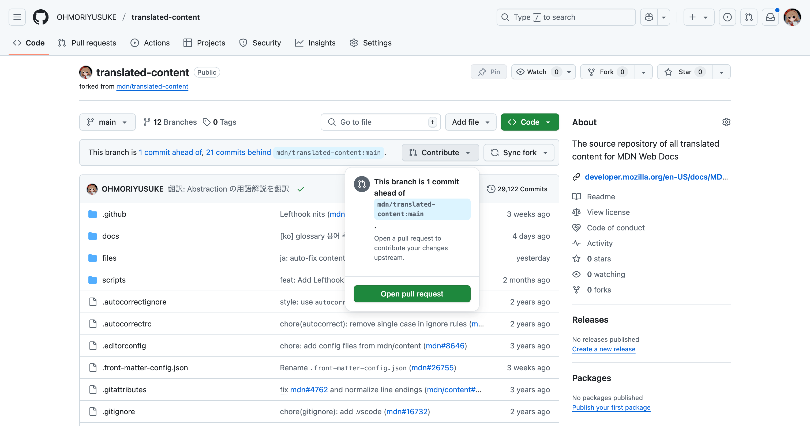
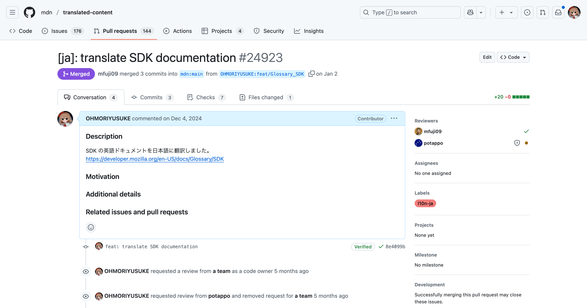

<div class="doc-header">
  <h1>MDN Web Docs に日本語翻訳でコントリビュート</h1>
  <div class="doc-author">うーたん（@uutan1108）</div>
</div>

# MDN Web Docs に日本語翻訳でコントリビュート

MDN Web Docs[^1]は、Web 開発者にとって欠かせない技術ドキュメントサイトです。HTML、CSS、JavaScript などの Web 技術について、詳細な解説やチュートリアルを提供しています。

このドキュメントは英語で書かれていますが、世界中の開発者がアクセスできるように多言語化が進められています。その一環として、日本語への翻訳プロジェクトも活発に行われています。

「オープンなプロジェクトへのコントリビュートってハードルが高そう…」と思っている方も多いでしょう。しかし、翻訳コントリビュートなら、プログラミングのスキルがなくても参加できます。この記事では、MDN Web Docs の日本語翻訳に参加する方法を、はじめての方にも分かりやすく解説していきます。

本記事では、はじめてオープンなプロジェクトへのコントリビュートに挑戦する方向けの解説をします。基本的な手順から丁寧に解説していきます。すでに GitHub アカウントをお持ちの方や、Node.js の環境構築に慣れている方は、該当する部分を読み飛ばしながら進めていただいて構いません。

[^1]: MDN Web Docs https://developer.mozilla.org/ja/

## GitHub アカウントを作る

MDN Web Docs への翻訳コントリビュートには、GitHub アカウントが必要です。まだアカウントをお持ちでない方は、次の手順で作成しましょう。

1. GitHub のトップページ[^2]にアクセスする
2. 「Sign up」ボタンをクリックする
3. 次の情報を入力する
   - メールアドレス
   - パスワード
   - ユーザー ID（他のユーザーと同じ ID は利用できない）
4. 「Create account」をクリックする
5. メールアドレス確認のメールが届くので、記載されているリンクをクリックして認証を完了させる

アカウント作成が完了したら、プロフィール情報を設定することをお勧めします。

- プロフィール画像の設定
- 自己紹介文の追加
- 所在地や所属組織の追加

これで GitHub アカウントの準備は完了です。次のステップに進みましょう。

[^2]: GitHub https://github.com/

## Node.js をインストールする

MDN Web Docs のローカル環境を構築するために、Node.js をインストールする必要があります。Node.js は JavaScript の実行環境で、多くの開発ツールで利用されています。

### Windows の場合

1. Node.js の公式サイト[^3]にアクセスする
2. 「LTS」と書かれたバージョンの「Windows Installer」をダウンロードする
3. ダウンロードしたインストーラーを実行する
4. インストーラーの指示にしたがって進める
5. インストールが完了したら、コマンドプロンプトを開いて次のコマンドを実行し、インストールを確認する
   ```shell
   $ node --version
   ```

### macOS の場合

macOS では Homebrew[^4] を使ってインストールします。

1. まず Homebrew をインストールする
   ```shell
   $ /bin/bash -c "$(curl -fsSL https://raw.githubusercontent.com/Homebrew/install/HEAD/install.sh)"
   ```
2. Node.js をインストールする
   ```shell
   $ brew install node
   ```
3. インストールされていることを確認する
   ```shell
   $ node --version
   ```

[^3]: Node.js 公式サイト https://nodejs.org/

[^4]: Homebrew とは、macOS 用のパッケージマネージャーです。ソフトウェアのインストールや管理を簡単に行うことができます。https://brew.sh

## Yarn をインストールする

MDN Web Docs のローカル環境では、パッケージマネージャーとして Yarn を採用しています。Yarn は Node.js のパッケージを効率的に管理するためのツールです。

### Yarn v4 のインストール

Yarn v4 は、Node.js に付属の Corepack を使用してインストールすることを推奨[^5]しています。

1. ターミナル（macOS）またはコマンドプロンプト（Windows）を開く
2. Corepack を有効にする
   ```shell
   $ corepack enable
   ```
3. Yarn をインストールする
   ```shell
   $ corepack prepare yarn --activate
   ```
4. インストールを確認する
   ```shell
   $ yarn --version
   ```

[^5]:
    Corepack は Node.js の将来のバージョンで標準機能から外れる予定ですが、現時点では推奨されるインストール方法となっています。
    https://github.com/nodejs/package-maintenance/blob/main/docs/version-management/proposal-next-steps.md

## 翻訳作業できる環境を作る

### MDN Web Docsの翻訳環境を構築する

MDN Web Docs の翻訳作業を行うために、次の手順でローカル環境を構築します。

#### 1. 作業用ディレクトリの作成

まず、翻訳作業用のディレクトリを作成します。好きな場所に`mdn-translation`ディレクトリを作成しましょう。

```shell
$ mkdir mdn-translation
$ cd mdn-translation
```

#### 2. 英語ドキュメントリポジトリのクローン

MDN Web Docs の英語のドキュメントが管理されているリポジトリをクローンします。

1. ブラウザで次のリポジトリにアクセスする。
   https://github.com/mdn/content

2. 「Code」ボタンをクリックし、HTTPS の URL をコピーする。



3. ターミナルで次のコマンドを実行する。[^4]

   ```shell
   mdn-translation $ git clone https://github.com/mdn/content
   ```

   [^4]: 本記事においては、`コマンドを実行するディレクトリ $ 実行するコマンド`でコマンドを表現する。

#### 3. 翻訳用リポジトリをフォーク

翻訳されたドキュメントを管理するためのリポジトリをフォークする。

フォークとは、GitHub 上で他のユーザーのリポジトリを自分のアカウントにコピーすることです。これにより、元のリポジトリに影響を与えることなく、自由に変更を加えることができます。

これから、このフォークしたリポジトリに翻訳したドキュメントを追加していきます。



#### 4. 翻訳用リポジトリのクローン

先ほどフォークした翻訳用リポジトリをクローンする。

```shell
mdn-translation $ git clone https://github.com/あなたのGitHubアカウントID/translated-content
```

#### 5. 必要なパッケージのインストール

この後、手元の PC で MDN Web Docs を立ち上げる際に必要なパッケージをインストールします。

1. content ディレクトリでパッケージをインストールする

   ```shell
   mdn-translation $ cd content
   content $ yarn install
   ```

これで、MDN Web Docs の翻訳作業に必要なローカル環境の構築が完了しました。

#### 6. 設定の追加

`content`ディレクトリで次のコマンドを実行してください。

```shell
content $ echo 'CONTENT_TRANSLATED_ROOT=../translated-content/files' > .env
```

「英語のドキュメントリポジトリ(`content`)」と「翻訳用リポジトリ(`translated-content`)」を関連づけるために必要です。

#### 7. 手元 PC での MDN Web Docs の立ち上げ

`content`ディレクトリで次のコマンドを実行してください。

1. 開発サーバーを起動する

   ```shell
   content $ yarn start
   ```

2. ブラウザで http://localhost:5042/ja/docs/Web/HTML にアクセスする

http://localhost:5042/en-US/docs/Web/HTML にアクセスすると翻訳前のドキュメントを開くことができます。

これで、ローカル環境で MDN Web Docs の英語版と日本語版の両方を確認できるようになりました。翻訳作業を行う際は、英語版の内容を参考にしながら、日本語版の翻訳を進めることができます。

次のように英語版と日本語版を開くことで効率的に翻訳作業を進められます。



## 翻訳できそうな MDN Web Docs のページを探す

MDN Web Docs の翻訳できそうなページを探すには、MDN 翻訳ステータス一覧表を活用します。特に用語の解説ページ（Glossary）は文章が短いため、翻訳の初心者にはお勧めです。

次のページから、日本語に翻訳されていない用語の解説のページを探すことができます。

https://mdn.lavoscore.org/?regex_b=glossary&sort=size-asc&filter=not-ja

用語以外のページを翻訳したい場合は次の URL から検索できます。

https://mdn.lavoscore.org/?filter=not-ja

表示されている URL をクリックして、次のような画面が表示された場合は翻訳前です。



## 翻訳する準備をする

翻訳したいドキュメントをみつけたら、次の手順で翻訳作業を始めます。

### 1. 翻訳対象のファイルを確認する

まず、翻訳したいドキュメントのファイルを確認します。たとえば、https://developer.mozilla.org/en-US/docs/Glossary/Abstraction の用語解説ページを翻訳します。

次の画像のように英語のドキュメントリポジトリ(`content`)に対象のファイルがあります。



ファイルの中を確認し、対象のドキュメントか確認します。

### 2. 翻訳用リポジトリにファイルをコピーする

翻訳対象のファイルを翻訳用リポジトリ（`translated-content`）にコピーします。

次の画像の場所に`abstraction`ディレクトリを作成し、その中に`index.md`を作成します。翻訳対象の英語ドキュメントのファイルをコピー&ペーストします。



次の URL にアクセスして、翻訳前のドキュメントが表示されたら成功です。

http://localhost:5042/ja/docs/Glossary/Abstraction

## 翻訳する

`translated-content`ディレクトリ内にコピーしたファイルを英語から日本語に翻訳します。

翻訳する際には次の点に注意しながら行います。

- 表記ガイドライン https://github.com/mozilla-japan/translation/wiki/Editorial-Guideline
- L10N ガイドライン https://github.com/mozilla-japan/translation/wiki/L10N-Guideline
- Mozilla 用語集 https://github.com/mozilla-japan/translation/wiki/Mozilla-L10N-Glossary
- 日本語の文体 https://docs.google.com/spreadsheets/d/1y-hC-xMXawCgcYZwJDnvuSlAOTgMRLLyqXurpYkJbYE/edit#gid=0

`translated-content`ディレクトリ内にコピーしたファイルの先頭に、次のように書かれています。

```markdown
---
title: Abstraction
slug: Glossary/Abstraction
page-type: glossary-definition
---
```

この内容を次のように書き換えます。

```markdown
---
title: Abstraction
slug: Glossary/Abstraction
l10n:
  sourceCommit: 7a551aaa034fbada3eb99e6fc924a0313b78307f
---
```

`sourceCommit`には翻訳するドキュメントの英語版ドキュメントのファイルの最新コミットのハッシュ値を書きます。次のように、対象のファイルの場所に移動して、コマンドでハッシュ値を取得できます。

```shell
mdn-translation $ cd content/files/en-us/glossary/abstraction/
abstraction $ ls
index.md
abstraction $ git log -n 1 --pretty=format:%H -- index.md
7a551aaa034fbada3eb99e6fc924a0313b78307f
```

これにより、翻訳したドキュメントが英語版のどのバージョンを元にしているかを追跡できます。

## MDN Web Docs にあなたが翻訳したドキュメントを提案する

翻訳が完了したら、GitHub でプルリクエストを作成して、翻訳内容を提案します。次の手順で行います。

### 1. 変更をコミットする

まず、翻訳した内容を Git にコミットします。

コミットとは、変更した内容を記録することです。Git では、変更を記録する前に、変更したファイルをステージングエリアに追加する必要があります。

1. 変更したファイルをステージングエリアに追加する

   ```shell
   abstraction $ git add index.md
   ```

2. 変更をコミットする

   `"翻訳: Abstraction の用語解説を翻訳"`の文章は何を翻訳したかを書きましょう。

   ```shell
   abstraction $ git commit -m "翻訳: Abstraction の用語解説を翻訳"
   ```

### 2. 変更をプッシュする

リモートリポジトリがあなたのリポジトリになっていることを確認します。

```shell
abstraction $ git config --get remote.origin.url
git@github.com:あなたのGitHubアカウントID/translated-content.git
```

コミットした変更を GitHub にプッシュします。

```shell
abstraction $ git push origin main
```

### 3. プルリクエストを作成する

プルリクエストとは、あなたの変更を本番環境に反映するための提案です。メンテナーが内容を確認し、問題がなければ本番環境に反映されます。

1. https://github.com/あなたのGitHubアカウントID/translated-content にアクセスする
2. 画像で示したポップアップの中のミドルのボタンを押す
   
3. プルリクエストのタイトルと説明を入力する
   
   画像の例ではタイトルは「[ja]: translate SDK documentation」。説明は、「SDK の英語ドキュメントを日本語に翻訳しました。https://developer.mozilla.org/en-US/docs/Glossary/SDK」と日本語の説明と翻訳前のドキュメントの URL を書いている。
   タイトルや説明は好みですが、あなたの翻訳が問題ないか確認してくださる方（メンテナー）は日本人で日本語話者なので日本語でも問題ありません。
4. 「Create pull request」ボタンをクリックする

これで、翻訳した内容が MDN Web Docs のメンテナーにレビューされます。レビューでは、翻訳の正確性や表記の統一性などが確認されます。レビュー後に問題がなければ、翻訳内容が MDN Web Docs に反映されます。

問題があった場合は、日本語で指摘があるので、修正して「MDN Web Docs にあなたが翻訳したドキュメントを提案する」の章の 1, 2 を再度行いましょう。

## まとめ

この記事では、MDN Web Docs の日本語翻訳に参加する方法を解説しました。主な手順は次のとおりです。

1. GitHub アカウントを作成する
2. Node.js と Yarn をインストールする
3. 翻訳作業用の環境を構築する
4. 翻訳したいページを探す
5. 翻訳作業を行う
6. プルリクエストを作成する

翻訳作業は、プログラミングのスキルがなくても参加できます。また、短い文章から始めることができるので、初心者の方でも気軽に挑戦できます。メンテナーも日本語話者なので、コミュニケーションも取りやすく、参加しやすい環境が整っています。あなたの翻訳が、多くの日本語話者の開発者の助けになることでしょう。

是非、MDN Web Docs の日本語翻訳プロジェクトに参加してみてください。

## 参考

本記事では、MDN Web Docs のローカル環境構築について詳しく解説しましたが、私自身も次のサイトを参考にしながら翻訳に挑戦しました。慣れている方はこちらも参考にしてみてください。

MDN 月例ミートアップ - 翻訳ガイド · HonKit https://mozilla-japan.github.io/mdn-translation-guide/
