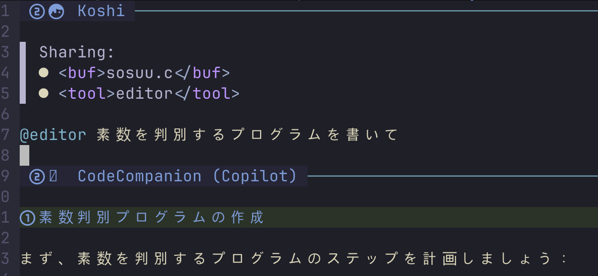

<div class="doc-header">
  <h1>CodeCompanion.nvimでみるAIコーディングの実装</h1>
  <div class="doc-author">叶 恒志</div>
</div>

# CodeCompanion.nvimで見るAIコーディングの実装

## はじめに

本記事ではNeovimのAIプラグインのCodeCompanion.nvim[^1]を軽く紹介した後、チャットの主要機能を実際の実装に基づいて詳細に解説していきます。

私はタブ補完のCopilot.lua[^2]をだけを使用してきました。しかし、コードをAIチャットクライアントにコピー&ペーストするのが面倒くさくなってきたし、AIエージェントやコードコンテキストの理解を試したくなってきたので、CodeCompanionを導入しました。導入したはいいものの、エージェントの動作が少し不安定で、いちいち共有したいファイルを選ぶのは思ったよりも面倒くさいです。少し手をいれる必要がありそうので、そのための下準備として実装を理解しておきたいと思います。これに加え、AIコーディングが一般的に何をしているかを把握しておきたいという思いもあります。

## CodeCompanion.nvimとは

CodeCompanionはNeovimでAIコーディングを実現するプラグインの一つです。他には、Avante.nvim[^3]が多く使われいて、思想の違い(Zed AI[^4]ライクかCursor[^5]ライクか) はあれど、共通して開いているファイルなどのコンテキスト共有機能、ファイル変更やコマンド実行を行うAIエージェント機能を提供しています。CodeCompanionは個別の処理に別々のモデルを選択できるのが面白い所ですが、今回は割愛します。また、**チャットに関連する機能**に絞って、実装を見ていきます。

<figure>
  
  <figcaption>CodeCompanionのチャットインターフェース画面</figcaption>
</figure>

あいさつすると決まった概要の説明ををしてくれます。

## CodeCompanionの使い方

CodeCompanionの基本的な使い方をいくつか紹介します。私は普段、GitHub Copilot[^6]で**Claude-3.7-sonnetモデル**を使用しています。

CodeCompanionではチャットを打つ際に、読み込みたいバッファや外部コンテキストの参照、AIに実行してほしいツールの指定をプロンプトに含めることができます。

| 分類 | 記号 | 概要 |
| --- | --- | --- |
| 変数 | `#` | bufferの参照やlspの診断情報を変数として文に書ける |
| スラッシュコマンド | `/` | 特定のプロンプトやアクションを実行する(ファイルを選んで、参照に追加) |
| ツール | `@` | LLMに実行してほしいツール(mcp、cmd)を共有できる |

## #buffer

#bufferを含めて書くことで，カレントバッファの内容を共有することができます

```
#bufferを説明してください
```

カレントバッファ(積分をする簡単なCのコード)について説明しています。

<figure>
  
  <figcaption>#bufferでカレントバッファを共有</figcaption>
</figure>

### /fetch

/fetchで共有したいURLを指定することができます。

試しにCodeCompanionのGithubを共有して聞いてみます。

/fetchを入力すると、URLの入力を求められます。

<figure>
  
  <figcaption>図3: URLを入力</figcaption>
</figure>

fetchに成功するとUIに`Sharing:`と表示され追加されたとわかります。回答もURLの内容に基づいています。

<figure>
  
  <figcaption>/fetchをURLを共有</figcaption>
</figure>

### @editor

@editorを書くと、LLMはNeovimバッファ内のコードを修正してくれるようになります。

バッファを指定し、@editorを含めて、指示してみます。
<figure>
  
  <figcaption>@editorでファイル編集を指示<figcaption>
</figure>

レスポンスが返ってくると、diffが表示され、acceptもしくはrejectができます。

なお、~~@editorを記述しても、たまにファイル修正が行われません…~~ 最新のバージョンでは動作は安定しています。

<figure>
  
  <figcaption>diff画面</figcaption>
</figure>

### チャット送信の実装

チャット機能に関する実装を見ていきます。

```
lua/
├── codecompanion/
│   ├── actions/
│   ├── adapters/
│   ├── helpers/
│   ├── providers/
│   ├── strategies/
│   │   ├── chat/
│   │   │   ├── agents/
│   │   │   ├── slash_commands/
│   │   │   ├── variables/
│   │   │   ├── debug.lua
│   │   │   ├── helpers.lua
│   │   │   ├── init.lua
│   │   │   ├── keymaps.lua
│   │   │   ├── references.lua
│   │   │   ├── subscribers.lua
│   │   │   ├── ui.lua
│   │   │   └── watchers.lua
```

LLMのモデルの操作には`adapters`、ツールの実行には`agents`でインタフェースを用意していて、保守性の高い設計です。チャット機能の実装は`lua/strategies/chat/`にあり、`init.lua`がエントリーファイルで、全体の処理を制御します。

`chat/init.lua`に`Chat`クラスがありデータと各操作が定義されています。

まず、チャットバッファで管理するデータについて確認しておきたいと思います。

```lua
function Chat.new(args)
    local id = math.random(10000000)
    log:trace("Chat created with ID %d", id)
    local self = setmetatable({
        context = args.context,
        cycle = 1,
        header_line = 1,
        from_prompt_library = args.from_prompt_library or false,
        id = id,
        last_role = args.last_role or config.constants.USER_ROLE,
        messages = args.messages or {},
        opts = args,
        refs = {},
        status = "",
        tool_flags = {},
        tools_in_use = {},
        create_buf = function()
            local bufnr = api.nvim_create_buf(false, true)
            api.nvim_buf_set_name(bufnr, string.format("[CodeCompanion] %d", id))
            vim.bo[bufnr].filetype = "codecompanion"
            return bufnr
        end,
    }, { __index = Chat }}
```

チャット履歴を`messages`、やり取りしているターン数を`cycle`、最新のチャットの先頭行数を`header_line`に保持しています。

基本ユーザのチャット送信にトリガして処理が走るので、`function Chat:submit(opts)`を追っていきます。
`function Chat:submit(opts)`のフローはバリデーションやUI制御などを除くと、以下のようになります。

```lua
Chat:submit開始
  ↓
1. チャットバッファからメッセージ解析 ts_parse_messages(self, self.header_line)
  ↓
2. ウォッチャーによる変更チェック ---UIで参照先の変更検知を読み込む
  ↓
3. messagesテーブルにメッセージ追加 self.addmessage()
  ↓
4. 変数とツール参照の置換     apply_tools_and_variables(message)
  ↓
5. 参照チェックとピン追加 ---UIでの参照の追加削除、固定操作を読み込む
  ↓
6. アダプター設定処理 ---アダプターはLLMとやり取りするためのインタフェースです
  ↓
7. HTTPリクエスト送信  clinet.new():request
  ↓
8. コールバックでのレスポンス処理     
				self.current_request = client
	        .new({ adapter = settings })
	        :request(self.adapter:map_roles(vim.deepcopy(self.messages)),
  ↓
9. done処理（コールバックの完了時)
```

まず、先頭行番号から最新のチャットを切り取ります。チャットはマークダウンで書かれるので、空欄や修飾子を除いて新しいメッセージを作成します。

```lua
{
  message = {
    content = "#bufferを説明して"
  }
}
```

これを`messages`テーブルに追加します。その後は変数やツールの修飾子(#@)を読み取り、対応する処理行います。

```lua
function Chat:apply_tools_and_variables(message)
    if self.agents:parse(self, message) then
        message.content = self.agents:replace(message.content)
    end
    if self.variables:parse(self, message) then
        message.content = self.variables:replace(message.content, self.context.bufnr)
    end
end
```

`message`をパースして、#bufferや@editorを検出して、機能を実行します。その後は参照が分かるように#bufferなどのシンボルを入れ替えます。(例: #buffer→`buffer 7 ('server.ts')`)

```lua
=== messages ===
{ {
    content = "You are an AI programming assistant named \"CodeCompanion\". You are currently plugged into the Neovim text editor on a user's machine.\n\nYour core tasks include:\n- Answering general programming questions.\n- Explaining how the code in a Neovim buffer works.\n- Reviewing the selected code in a Neovim buffer.\n- Generating unit tests for the selected code.\n- Proposing fixes for problems in the selected code.省略",
    cycle = 1,
    id = 1878391891,
    opts = {
      tag = "from_config",
      visible = false
    },
    role = "system"
  }, {
    content = "hello",
    cycle = 1,
    id = 1509314226,
    opts = {
      visible = true
    },
    role = "user"
  }
} }
```

新しいチャット内容を，元のシステムプロンプトに追加してLLMに送ります。直前の5件のメッセージまで送信といった制限はなく、**バッファ内のすべてやり取りを送信**する仕様です。各LLMにトークン数の上限を設定でき(default:15000)、上限を超えるとエラーとなり、リクエストが送信されません。

```lua
  if has_tools then
    tools = self.adapter.handlers.tools.format_tool_calls(self.adapter, tools)
    self:add_message({
      role = config.constants.LLM_ROLE,
      tool_calls = tools,
      opts = {
        visible = false,
      },
    })
    return self.agents:execute(self, tools)
  end
```

最後にコールバックでレスポンスをUI(チャットバッファ)に書き込み、LLMの返答からツールを実行します。

## 各機能の動作

各機能に応じた処理を見ていたいと思います。それらの処理は共通して、チャットバッファのメッセージをパースして、対応するモジュールを呼び出して、`messages`にメッセージを追加します。

```lua
local ok, module = pcall(require, "codecompanion." .. path .. "." .. variable)
```

設定ファイルに書いたネームスペースから解決します。

```lua
    --config.lua
    ["buffer"] = {
      callback = "strategies.chat.variables.buffer",
      description = "Share the current buffer with the LLM",
      opts = {
        contains_code = true,
        has_params = true,
      },
```

自作した機能やプロンプトを設定ファイルに書くことで簡単に仕様できるようになるので、拡張性はかなり高いです。

### スラッシュコマンド(/)によるコンテキスト共有

まず、スラッシュコマンドの入力から見ていきます。

```lua
api.nvim_create_autocmd("CompleteDone", {
    group = self.aug,
    buffer = bufnr,
    callback = function()
        local item = vim.v.completed_item
        if item.user_data and item.user_data.type == "slash_command" then
            -- Clear the word from the buffer
            local row, col = unpack(api.nvim_win_get_cursor(0))
            api.nvim_buf_set_text(bufnr, row - 1, col - #item.word, row - 1, col, { "" })

            completion.slash_commands_execute(item.user_data, self)
        end
    end,
})
```

どうやら、`CompleteDone` 入力の補完完了にトリガして、実行しているようです。補完系のプラグインを導入していない環境や動作を独自に変えている場合はうまく動作しないかもしれません。私の環境ではプラグイン**nvim-cmp**を外したら動作しません。

/fetchコマンドの動作を見ていきます。

/fetchは`lua/codecompanion/Chat/slash_commands/fetch.lua`にあります。

パースにはjina.ai[^6]を使用しています。jinaはURL やウェブ検索から LLM に適した入力を得られる API で、テキストをのみを抽出しています。pdfを読み取れる点と画像の注を抽出している点で便利そうです。ただテキストを抽出しているだけなので、トークン数に気を配る必要がありそうです。

```lua
 {
    content = "Here is the output from https://news.yahoo.co.jp/pickup/6537567 that I'm sharing with you:\n\n<content>\nYahoo!ニュース\n\n最短3分から受験可能！　ヤフー防災模試で備えを\n\nYahoo! JAPANヘルプ\nキーワード：\n 検索\n須賀健太\n\t\nIDでもっと便利に新規取得\nログイン アプリはじめて利用限定、お得な半額クーポン\nマイページ\n購入履歴\nトップ\n速報\nライブ\nエキスパート\nオリジナル\nみんなの意見\nランキング\n有料\n主要\n国内\n国際\n経済\nエンタメ\nスポーツ\nIT\n科学\nライフ\n地域\nトピックス一覧\n首相 省略\n© LY Corporation\n</content>",
    cycle = 1,
    id = 1972871335,
    opts = {
      reference = "<url>https://news.yahoo.co.jp/pickup/6537567</url>",
      visible = false
    },
    role = "user"
   }
```

抽出したテキストにプロンプトを加えて、メッセージに追加しています。

```lua
  { content = "Here is the output from https://platform.openai.com/docs/guides/function-calling?api-mode=chat&lang=curl&example=get-weather#overview that I'm sharing with you:\n\n<content>\n\n</content>",
    cycle = 1,
    id = 421072586,
    opts = {
      reference = "<url>https://platform.openai.com/docs/guides/function-calling?api-mode=chat&lang=curl&example=get-weather#overview</url>",
      visible = false
    },
    role = "user"
  } }
```

サイト(open.ai)によっては、Bot対策により内容を抽出できないので、その場合は**URLのみ**をメッセージに追加します。しかし、テキストを含めない場合でも、返答は少し異なれど、精度の差はほとんどない印象でした(**GitHub Copilot claude-3.7-sonnet**の場合）。テキスト抽出をせずに、URLだけをメッセージに追加したほうが、トークン数的にはいいのかもしれません。

スラッシュコマンドによるコンテキスト共有は、変数やツールと`messages`への追加のタイミングが異なります。スラッシュコマンドはチャットを編集している途中、変数やツールは送信するタイミングで追加されます。これにより、コンテキストを送ってからから指示をするのか、指示してからコンテキストを送るかで、ほんの少しLLMへのお願いの仕方が異なります。返答の質にほとんど影響がないと思いますが、もしかすると役に立つかもしれないので、メモしておきます。

### 変数(#)によるコンテキスト共有
#bufferを例に動作を見ていきます。

```lua
  local content = buf_utils.format_with_line_numbers(bufnr)
```

`format_with_line_numbers()`はバッファの参照を受取り，コードの行番号を毎行付与して、空白を削除します。

```lua
 {
    content = "buffer 7 (`server.ts`)を説明して",
    cycle = 1,
    id = 1509314226,
    opts = {
      visible = true
    },
    role = "user"
  }, {
    content = 'Here is the content from the buffer.\n\nBuffer Number: 7\nName: server.ts\nPath: /Users/koshi/koshi_workspace/comicEmotion/src/server.ts\nFiletype: typescript\nContent:**コードは省略します**\n',
    cycle = 1,
    id = 197956778,
    opts = {
      reference = "<buf>server.ts</buf>",
      tag = "variable",
      visible = false
    },
    role = "user"
```

(#buffer→`buffer 7 ('server.ts')`)、チャットの変数を入れ替えて、LLMに参照がわかるようにバッファ情報をコード本体に付けて、`messages`に加えます。

#bufferでは指定したバッファの内容をそのままLLMに送ります。ファイルの読み込みも同様に、行番号付けてそのまま送ります。ただ、CodeCompanionにはプロジェクト下のファイルをすべて読み込むというような機能はないので(プロジェクト単位でJsonファイルで読み込みたいファイルを設定できますが、ファイルを個別に一つずつ書く必要があって非常に面倒です。一方で、意図せずにライブラリのコードすべて送信するようなことは起こりにくいです。

### ツール(@)によるツール実行

CodeCompanionのツール実行は、**ツールの意図**や**スキーマを規定したプロンプト**によって、LLMにスキーマに従った返答を要求します。返答に含まれるスキーマをプラグイン側で解釈して、対応する操作を実行します。これは一般的に"Tool use"と呼ばれるデザインパターンの実装です。

<figure>
  
  <figcaption>図7: ツール実行のシーケンス図</figcaption>
</figure>

ツール実行のアーキテクチャです。

- **Agent**: LLMのレスポンスからツール指示を解析し、実行を管理
- **Tool Executor**: ツールの実行を担当
- **Tool**: 実際の機能を実装したモジュール（@editorなど）

AgentでLLMからの指示をパースして、キュー積んでいきます。ToolExecutorはキューが空になるまで、合致したツールを実行します。

このアーキテクチャでは**エージェントはLLMからの指示を一括で実行します**。

> 
> LLM 「ファイル作って」　Agent「作った」
> 
> LLM「おけ　次はファイル内容を書き換えて」　Agent「おわった」
> 
> LLM「おけ　次は…」

ではなく

> 
> LLM 「ファイル作ってからこの内容にして」　Agent「わかりました」

というようなやり取りをします。なので、柔軟さに欠けるので複雑なタスクには向かないかもしれません。

@editorを例に具体的な動作を見ていきます。

`apply_tools_and_variables(message)`で`agents:parse()`を呼び出し、メッセージに含まれる@editorを検出して、対応するツールを実行します。

@editorの場合はまず、ツール仕様全般とツールのスキーマについて指示書、そしてコードを`messages`を加えます。英語のプロンプトですが、見やすさのため日本語訳しています。

```markdown
# ツールアクセスと実行ガイドライン

### 概要
特定のタスクをサポートするための専門ツールが利用可能になりました。これらのツールはユーザーが明示的に要求した場合にのみ使用できます。

### 一般的なルール
- **ユーザー主導の実行:** ユーザーが特定のツールの使用を明示的に指示した場合のみ使用する（例：cmd_runnerの場合は「コマンドを実行して」など）
- **厳格なスキーマ準拠:** ツール呼び出し時には提供されたXMLスキーマに正確に従う
- **XML形式:** 応答は常にXMLとして指定されたマークダウンコードブロック内で、`<tools></tools>`タグで囲む
- **有効なXML:** 構築するXMLは有効で整形式である必要がある
- **複数コマンド:**
  - 同じタイプのコマンドを発行する場合は、一つの`<tools></tools>`ブロック内に複数の`<action></action>`エントリを含める
  - 異なるツールのコマンドを発行する場合は、それぞれを`<tool></tool>`タグで囲み、`<tools></tools>`ブロック内に配置する
- **副作用なし:** ツールの呼び出しは基本タスクや会話構造を変更するべきではない
```

CodeCompanionでは独自に`XML`の出力を定義して、LLMに出力されるアプローチを取ってい~~ます。~~いました。明示的に指示した場合のみ使用するとありますが、指示してない場合でも、ツールが実行されます…

執筆している途中で、CodeCompanionの新バージョンがリリースされ、方式が変更されました。今は、OpenAIが定めた、LLMがアプリケーションでツール呼び出し枠組みであるFunction calling[^7]のスキーマ(JSON)に合わせるように変更されています。当初は、まだFunction callingの実装が進んでいなく、独自のスキーマを考案する必要があったが、現在は多くのLLMはFunction callingに対してファインチューニングしていて、精度が高いとのこと。

> @editorを記述しても、たまにファイル修正が行われません…
> 

これは`XML`形式の指示の精度によるもので、Function callingでは安定しています。

```markdown
# エディターツール (`editor`) - 拡張ガイドライン
### 目的:　省略
### 使用タイミング:　省略
### 実行形式:　省略
- 常にXMLマークダウンコードブロックを返す
- ユーザーが共有したバッファ番号を必ず`<buffer></buffer>`タグに含める（提供されていない場合はユーザーに確認）
- 各コード操作は以下の条件を満たす必要がある:
  - 特殊文字を保持するためCDATAセクションで囲む（CDATAセクションにより`<`や`&`などの文字がXMLマークアップとして解釈されない）
  - XMLスキーマに厳密に従う
- 複数のアクション（追加、更新、削除）を順番に実行する場合は、一つのXMLブロック内の`<tool></tool>`タグ内に、個別の`<action></action>`エントリとして組み合わせる
### XMLスキーマ:　省略
ツール呼び出しは以下の構造に従う必要があります:
d) **複数アクション**（複数のアクションを順番に実行する必要がある場合）:
xml
<tools>
  <tool name="editor">
    <action type="delete">
      <end_line>13</end_line>
      <start_line>13</start_line>
      <buffer>5</buffer>
    </action>
    <action type="add">
      <line>20</line>
      <buffer>5</buffer>
      <code><![CDATA[function M.hello_world()]]></code>
    </action>
  </tool>
</tools>
### 重要な考慮事項:　省略
### 注意事項:　省略
```
```xml

ファイル編集のxmlの例をプロンプトに含んでいて、行数とバッファ番号で編集箇所を返すように指示します。
<tools>
  <tool name="editor">
    <action type="update">
      <buffer>51</buffer>
      <start_line>7</start_line>
      <end_line>7</end_line>
      <code><![CDATA[double integral (double left, double right, int num){]]></code>
    </action>
    <action type="update">
      <buffer>51</buffer>
      <start_line>28</start_line>
      <end_line>37</end_line>
      <code><![CDATA[int main (void) {
    int left, right, num;
    printf ("積分範囲を入力してください\n");
    printf ("左: ");
    scanf ("%d", &left);
    printf ("右: ");
    scanf ("%d", &right);
    printf ("分割数: ");
    scanf ("%d", &num);
    printf ("∫[%d,%d] x² dx = %f\n", left, right, integral(left, right, num));
    return 0;
}
]]></code>
    </action>
  </tool>
</tools>
```

このような`XML`が返ってくるので、これをパースして、適したツールを実行します。

## まとめ

CodeCompanionの各機能の処理の流れや、コンテキスト共有の内容を確認しました。

- /fetchはwebページのテキスト丸ごと
- /bufferはファイルのテキスト丸ごと
- @editorはLLMにXML出力を指示して、返ってきたXMLを読み取り実行

実装を見る前は、コンテキストの読み込みやAIによるツール実行は魔法みたいなことをしていると思ってたので、率直な実装で拍子抜けした印象です。そりゃ、変に削らず、丸ごと送るほうが精度がいいだろ！APIを直接叩いている場合は、トークン数を節約したいので、なんらかの工夫はしたいですが。CodeCompanionの一つ一つの機能はシンプルで、簡単に機能を追加、組み合わせてもコンフリクトが起こりづらく、拡張性に優れている設計が特徴で、改良して長く使っていけるプラグインだと感じました。

CodeCompanionを導入した素の状態では、コンテキスト読み込みの機能が単純なものしかなく、Cursor賢くやってくれません。Avante.nvimのように、プロジェクトのファイルをインデックス化して、読み込む機能(Codebase)はありません。また、バッファやファイルの読み込みは自分で明示的に書く必要があります。私はエディタ内でAIチャットを使うからには、現在のプロジェクトや作業ディレクトリを勝手に読み込んでいてほしい派なので、今後はこの実装を踏まえて、自分にあったコンテキスト読み込みを実現していきたいと思います。

拡張機能として、プロジェクトをインデックス化するVectorCodeが既にあり、連携させることでCodebaseを実現することができます。ただし、VectorCodeのCLIを使って、予めプロジェクトをインデックス化する必要があります。操作が面倒で、関心が分散していて、扱いにくさを感じます。Cursorのように、暗黙的に読み込ませるにはある程度コードを理解して、自分でコードを書く努力が必要です。自分のワークフローに改造できるのがNeovimの良さではありますが、逆に改造しないと、主流のエディターに利便性で劣るので、Neovimを使っていくためには熱が必要とつくづく思います。


[^1]: CodeCompanion.nvim: GitHub: https://github.com/Bryley/codecompanion.nvim 

[^2]: Copilot.lua: GitHub: https://github.com/zbirenbaum/copilot.lua

[^3]: Avante.nvim: GitHub: https://github.com/willothy/avante.nvim

[^4]: Zed AI: Zedエディターに組み込まれたAIコーディング機能。https://zed.dev/

[^5]: Cursor: 。https://cursor.sh/

[^6]: GitHub Copilot: https://github.com/features/copilot

[^7]: Function calling: 。https://platform.openai.com/docs/guides/function-calling
